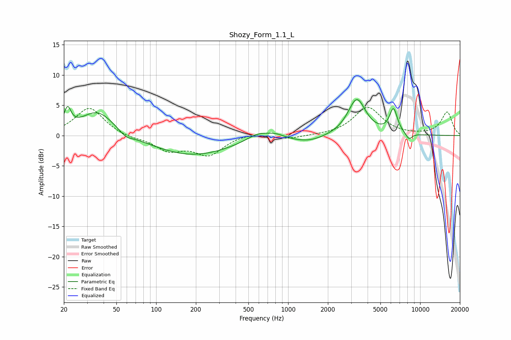

# Shozy_Form_1.1_L
See [usage instructions](https://github.com/jaakkopasanen/AutoEq#usage) for more options and info.

### Parametric EQs
Apply preamp of -6.0 dB when using parametric equalizer.

|   # | Type    |   Fc (Hz) |    Q |   Gain (dB) |
|-----|---------|-----------|------|-------------|
|   1 | Peaking |        21 | 5.39 |         3.3 |
|   2 | Peaking |        36 | 1.11 |         4.2 |
|   3 | Peaking |        59 | 2.91 |        -0.8 |
|   4 | Peaking |       188 | 0.47 |        -3.3 |
|   5 | Peaking |       593 | 1.55 |         1.3 |
|   6 | Peaking |       807 | 2.3  |         0.6 |
|   7 | Peaking |      1420 | 1.13 |        -1   |
|   8 | Peaking |      3312 | 2.09 |         6   |
|   9 | Peaking |      6278 | 4.54 |         4   |
|  10 | Peaking |      8220 | 5.15 |        -1.1 |

### Fixed Band EQs
When using fixed band (also called graphic) equalizer, apply preamp of **-4.7 dB** (if available) and set gains manually with these parameters.

|   # | Type    |   Fc (Hz) |    Q |   Gain (dB) |
|-----|---------|-----------|------|-------------|
|   1 | Peaking |        31 | 1.41 |         4.6 |
|   2 | Peaking |        62 | 1.41 |        -0.4 |
|   3 | Peaking |       125 | 1.41 |        -2.3 |
|   4 | Peaking |       250 | 1.41 |        -3.1 |
|   5 | Peaking |       500 | 1.41 |         0.5 |
|   6 | Peaking |      1000 | 1.41 |        -0.5 |
|   7 | Peaking |      2000 | 1.41 |         0   |
|   8 | Peaking |      4000 | 1.41 |         4.6 |
|   9 | Peaking |      8000 | 1.41 |         0   |
|  10 | Peaking |     16000 | 1.41 |         3.9 |

### Graphs

