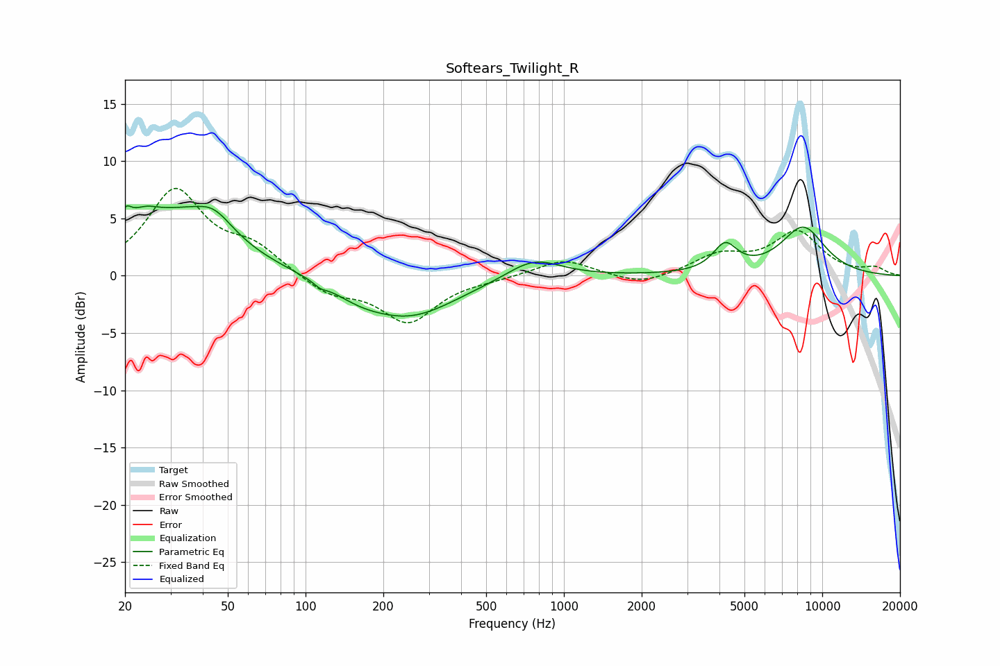

# Softears_Twilight_R
See [usage instructions](https://github.com/jaakkopasanen/AutoEq#usage) for more options and info.

### Parametric EQs
Apply preamp of -6.2 dB when using parametric equalizer.

|   # | Type    |   Fc (Hz) |    Q |   Gain (dB) |
|-----|---------|-----------|------|-------------|
|   1 | Peaking |        20 | 5.84 |         1.9 |
|   2 | Peaking |        24 | 2.36 |         1.7 |
|   3 | Peaking |        33 | 0.74 |         4.9 |
|   4 | Peaking |        44 | 2.03 |         1.7 |
|   5 | Peaking |       114 | 5.96 |        -0.4 |
|   6 | Peaking |       160 | 1.43 |        -0.8 |
|   7 | Peaking |       251 | 0.76 |        -3.5 |
|   8 | Peaking |       764 | 1.35 |         1.8 |
|   9 | Peaking |      4208 | 3.05 |         2.3 |
|  10 | Peaking |      8431 | 1.48 |         4.2 |

### Fixed Band EQs
When using fixed band (also called graphic) equalizer, apply preamp of **-7.7 dB** (if available) and set gains manually with these parameters.

|   # | Type    |   Fc (Hz) |    Q |   Gain (dB) |
|-----|---------|-----------|------|-------------|
|   1 | Peaking |        31 | 1.41 |         7.3 |
|   2 | Peaking |        62 | 1.41 |         2.2 |
|   3 | Peaking |       125 | 1.41 |        -1.6 |
|   4 | Peaking |       250 | 1.41 |        -4   |
|   5 | Peaking |       500 | 1.41 |        -0.2 |
|   6 | Peaking |      1000 | 1.41 |         1.5 |
|   7 | Peaking |      2000 | 1.41 |        -0.9 |
|   8 | Peaking |      4000 | 1.41 |         1.7 |
|   9 | Peaking |      8000 | 1.41 |         3.7 |
|  10 | Peaking |     16000 | 1.41 |         0.6 |

### Graphs

