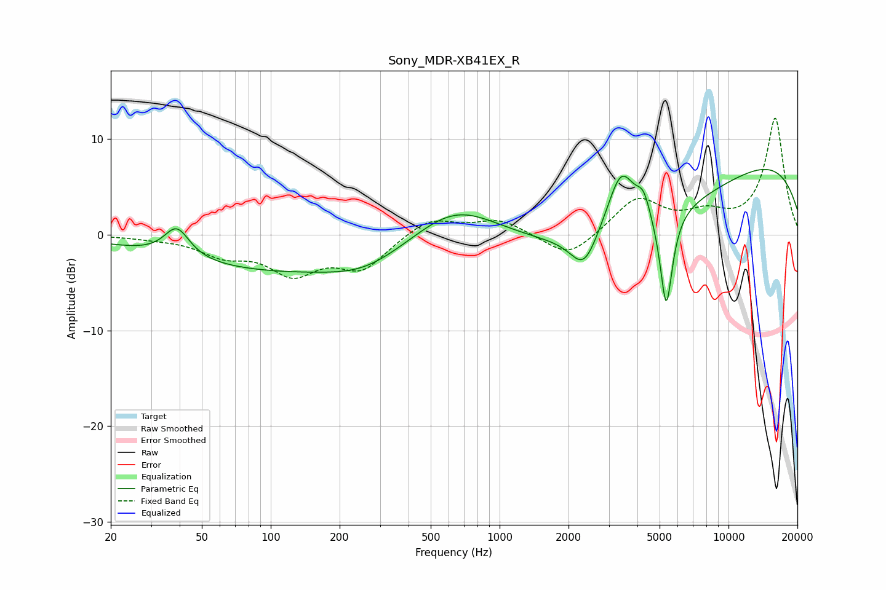

# Sony_MDR-XB41EX_R
See [usage instructions](https://github.com/jaakkopasanen/AutoEq#usage) for more options and info.

### Parametric EQs
Apply preamp of -6.9 dB when using parametric equalizer.

|   # | Type    |   Fc (Hz) |    Q |   Gain (dB) |
|-----|---------|-----------|------|-------------|
|   1 | Peaking |        39 | 2.61 |         3.1 |
|   2 | Peaking |       124 | 0.25 |        -3.8 |
|   3 | Peaking |       257 | 0.93 |        -1.2 |
|   4 | Peaking |       634 | 0.74 |         4.3 |
|   5 | Peaking |      2337 | 2.4  |        -3.7 |
|   6 | Peaking |      3397 | 2.27 |         6.6 |
|   7 | Peaking |      4256 | 4.67 |         2.3 |
|   8 | Peaking |      4328 | 0.32 |        -6.3 |
|   9 | Peaking |      5348 | 5.07 |       -10.4 |
|  10 | Peaking |     10000 | 0.21 |         9.5 |

### Fixed Band EQs
When using fixed band (also called graphic) equalizer, apply preamp of **-12.3 dB** (if available) and set gains manually with these parameters.

|   # | Type    |   Fc (Hz) |    Q |   Gain (dB) |
|-----|---------|-----------|------|-------------|
|   1 | Peaking |        31 | 1.41 |        -0.2 |
|   2 | Peaking |        62 | 1.41 |        -1.8 |
|   3 | Peaking |       125 | 1.41 |        -3.7 |
|   4 | Peaking |       250 | 1.41 |        -3.3 |
|   5 | Peaking |       500 | 1.41 |         1.8 |
|   6 | Peaking |      1000 | 1.41 |         1.6 |
|   7 | Peaking |      2000 | 1.41 |        -2.6 |
|   8 | Peaking |      4000 | 1.41 |         3.7 |
|   9 | Peaking |      8000 | 1.41 |         1.8 |
|  10 | Peaking |     16000 | 1.41 |        12.1 |

### Graphs

