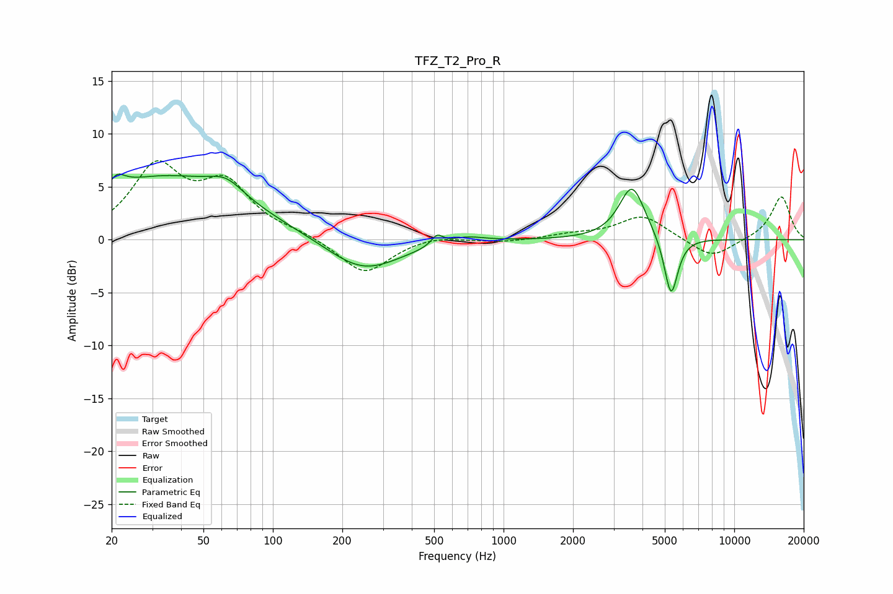

# TFZ_T2_Pro_R
See [usage instructions](https://github.com/jaakkopasanen/AutoEq#usage) for more options and info.

### Parametric EQs
Apply preamp of -6.3 dB when using parametric equalizer.

|   # | Type    |   Fc (Hz) |    Q |   Gain (dB) |
|-----|---------|-----------|------|-------------|
|   1 | Peaking |        22 | 5.37 |         3.1 |
|   2 | Peaking |        22 | 5.9  |        -2.1 |
|   3 | Peaking |        34 | 0.4  |         5.9 |
|   4 | Peaking |        63 | 1.9  |         1.5 |
|   5 | Peaking |       246 | 0.88 |        -3.2 |
|   6 | Peaking |       515 | 5.7  |         1   |
|   7 | Peaking |       686 | 1.75 |         0.6 |
|   8 | Peaking |      3610 | 2.55 |         5.3 |
|   9 | Peaking |      3654 | 3.73 |        -0.2 |
|  10 | Peaking |      5321 | 4.69 |        -5.8 |

### Fixed Band EQs
When using fixed band (also called graphic) equalizer, apply preamp of **-7.6 dB** (if available) and set gains manually with these parameters.

|   # | Type    |   Fc (Hz) |    Q |   Gain (dB) |
|-----|---------|-----------|------|-------------|
|   1 | Peaking |        31 | 1.41 |         6.6 |
|   2 | Peaking |        62 | 1.41 |         4.8 |
|   3 | Peaking |       125 | 1.41 |         0.5 |
|   4 | Peaking |       250 | 1.41 |        -3.3 |
|   5 | Peaking |       500 | 1.41 |         0.5 |
|   6 | Peaking |      1000 | 1.41 |        -0.3 |
|   7 | Peaking |      2000 | 1.41 |         0.4 |
|   8 | Peaking |      4000 | 1.41 |         2.3 |
|   9 | Peaking |      8000 | 1.41 |        -1.8 |
|  10 | Peaking |     16000 | 1.41 |         4.1 |

### Graphs

