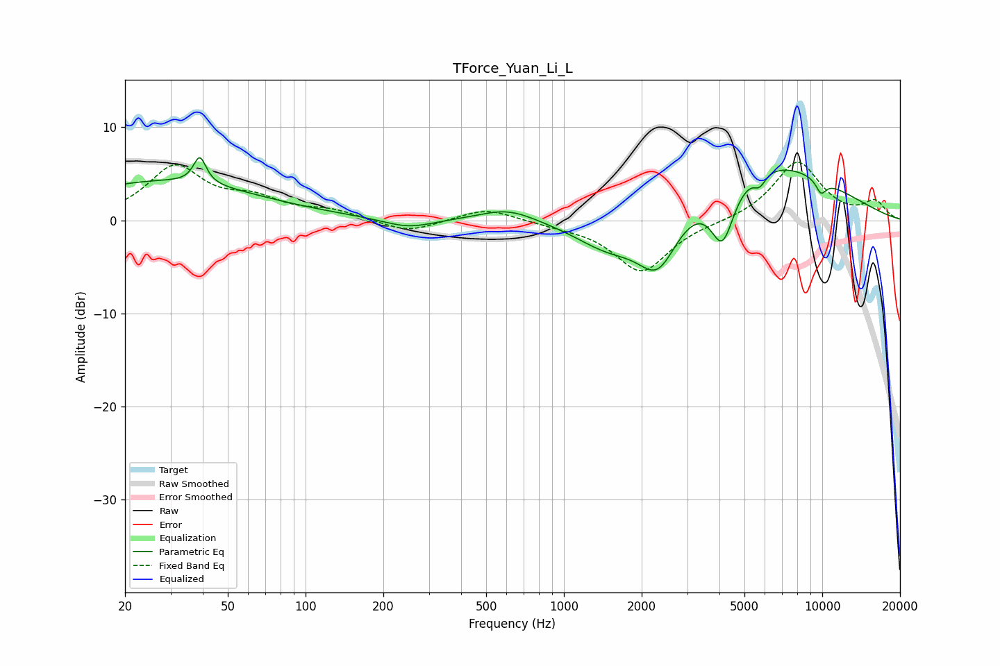

# TForce_Yuan_Li_L
See [usage instructions](https://github.com/jaakkopasanen/AutoEq#usage) for more options and info.

### Parametric EQs
Apply preamp of -6.8 dB when using parametric equalizer.

|   # | Type    |   Fc (Hz) |    Q |   Gain (dB) |
|-----|---------|-----------|------|-------------|
|   1 | Peaking |        28 | 0.39 |         4.2 |
|   2 | Peaking |        39 | 6    |         2.9 |
|   3 | Peaking |       250 | 1.44 |        -1   |
|   4 | Peaking |       606 | 1.28 |         1.4 |
|   5 | Peaking |      1503 | 1.01 |        -3.6 |
|   6 | Peaking |      2314 | 1.72 |        -6.4 |
|   7 | Peaking |      4111 | 2.95 |        -6.6 |
|   8 | Peaking |      5639 | 0.44 |         6.8 |
|   9 | Peaking |      5726 | 5.93 |        -1.3 |
|  10 | Peaking |      9892 | 5.96 |        -1.5 |

### Fixed Band EQs
When using fixed band (also called graphic) equalizer, apply preamp of **-6.3 dB** (if available) and set gains manually with these parameters.

|   # | Type    |   Fc (Hz) |    Q |   Gain (dB) |
|-----|---------|-----------|------|-------------|
|   1 | Peaking |        31 | 1.41 |         5.6 |
|   2 | Peaking |        62 | 1.41 |         1.9 |
|   3 | Peaking |       125 | 1.41 |         0.9 |
|   4 | Peaking |       250 | 1.41 |        -1.4 |
|   5 | Peaking |       500 | 1.41 |         1.4 |
|   6 | Peaking |      1000 | 1.41 |        -0.4 |
|   7 | Peaking |      2000 | 1.41 |        -5.5 |
|   8 | Peaking |      4000 | 1.41 |        -0.1 |
|   9 | Peaking |      8000 | 1.41 |         6.3 |
|  10 | Peaking |     16000 | 1.41 |         1.9 |

### Graphs

