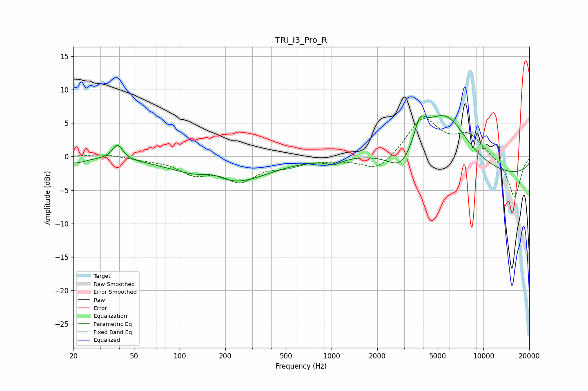

# TRI_I3_Pro_R
See [usage instructions](https://github.com/jaakkopasanen/AutoEq#usage) for more options and info.

### Parametric EQs
Apply preamp of -6.2 dB when using parametric equalizer.

|   # | Type    |   Fc (Hz) |    Q |   Gain (dB) |
|-----|---------|-----------|------|-------------|
|   1 | Peaking |        20 | 2.1  |        -0.9 |
|   2 | Peaking |        39 | 4.22 |         2.3 |
|   3 | Peaking |       167 | 1.58 |         1.6 |
|   4 | Peaking |       198 | 0.58 |        -4.6 |
|   5 | Peaking |      1037 | 2.89 |        -0.8 |
|   6 | Peaking |      2943 | 1.37 |        -5.5 |
|   7 | Peaking |      3799 | 3.84 |         3.1 |
|   8 | Peaking |      3869 | 0.67 |         6   |
|   9 | Peaking |      5816 | 1.02 |         5.2 |
|  10 | Peaking |     10000 | 0.18 |        -3.1 |

### Fixed Band EQs
When using fixed band (also called graphic) equalizer, apply preamp of **-5.8 dB** (if available) and set gains manually with these parameters.

|   # | Type    |   Fc (Hz) |    Q |   Gain (dB) |
|-----|---------|-----------|------|-------------|
|   1 | Peaking |        31 | 1.41 |         0.4 |
|   2 | Peaking |        62 | 1.41 |        -0.4 |
|   3 | Peaking |       125 | 1.41 |        -2.3 |
|   4 | Peaking |       250 | 1.41 |        -3.3 |
|   5 | Peaking |       500 | 1.41 |        -1.1 |
|   6 | Peaking |      1000 | 1.41 |        -0.3 |
|   7 | Peaking |      2000 | 1.41 |        -2.3 |
|   8 | Peaking |      4000 | 1.41 |         5.7 |
|   9 | Peaking |      8000 | 1.41 |         3   |
|  10 | Peaking |     16000 | 1.41 |        -6.2 |

### Graphs

