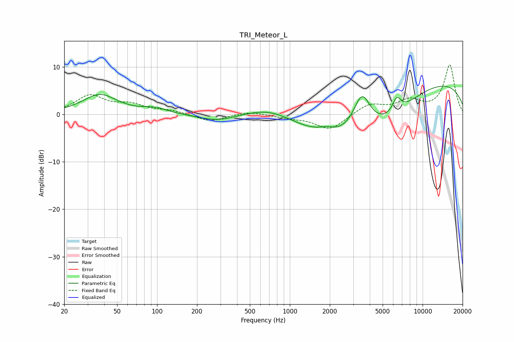

# TRI_Meteor_L
See [usage instructions](https://github.com/jaakkopasanen/AutoEq#usage) for more options and info.

### Parametric EQs
Apply preamp of -6.0 dB when using parametric equalizer.

|   # | Type    |   Fc (Hz) |    Q |   Gain (dB) |
|-----|---------|-----------|------|-------------|
|   1 | Peaking |        37 | 1.1  |         4.1 |
|   2 | Peaking |        96 | 1.55 |         1.1 |
|   3 | Peaking |       285 | 0.98 |        -1.4 |
|   4 | Peaking |       714 | 0.77 |         2.6 |
|   5 | Peaking |      1902 | 2.21 |         1   |
|   6 | Peaking |      3491 | 1.91 |         9.4 |
|   7 | Peaking |      3661 | 0.38 |       -12   |
|   8 | Peaking |      6386 | 4.16 |         3.1 |
|   9 | Peaking |      9813 | 0.22 |         8.4 |
|  10 | Peaking |     10000 | 0.74 |         1   |

### Fixed Band EQs
When using fixed band (also called graphic) equalizer, apply preamp of **-10.5 dB** (if available) and set gains manually with these parameters.

|   # | Type    |   Fc (Hz) |    Q |   Gain (dB) |
|-----|---------|-----------|------|-------------|
|   1 | Peaking |        31 | 1.41 |         3.8 |
|   2 | Peaking |        62 | 1.41 |         1.8 |
|   3 | Peaking |       125 | 1.41 |         0.7 |
|   4 | Peaking |       250 | 1.41 |        -1.5 |
|   5 | Peaking |       500 | 1.41 |         0.7 |
|   6 | Peaking |      1000 | 1.41 |        -0.6 |
|   7 | Peaking |      2000 | 1.41 |        -3.3 |
|   8 | Peaking |      4000 | 1.41 |         2.1 |
|   9 | Peaking |      8000 | 1.41 |         2.6 |
|  10 | Peaking |     16000 | 1.41 |        10.3 |

### Graphs

