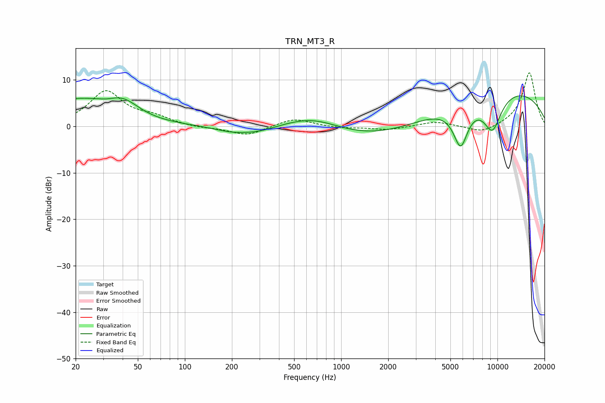

# TRN_MT3_R
See [usage instructions](https://github.com/jaakkopasanen/AutoEq#usage) for more options and info.

### Parametric EQs
Apply preamp of -6.7 dB when using parametric equalizer.

|   # | Type    |   Fc (Hz) |    Q |   Gain (dB) |
|-----|---------|-----------|------|-------------|
|   1 | Peaking |        20 | 0.62 |         5.5 |
|   2 | Peaking |        32 | 5.22 |        -0.1 |
|   3 | Peaking |        41 | 1.46 |         3.2 |
|   4 | Peaking |       199 | 1.22 |        -1   |
|   5 | Peaking |       292 | 1.18 |        -1.1 |
|   6 | Peaking |       659 | 0.78 |         3.1 |
|   7 | Peaking |      1892 | 0.38 |        -3.9 |
|   8 | Peaking |      5815 | 2.81 |        -9   |
|   9 | Peaking |      9278 | 2.05 |        -7.9 |
|  10 | Peaking |      9747 | 0.25 |         8.7 |

### Fixed Band EQs
When using fixed band (also called graphic) equalizer, apply preamp of **-11.6 dB** (if available) and set gains manually with these parameters.

|   # | Type    |   Fc (Hz) |    Q |   Gain (dB) |
|-----|---------|-----------|------|-------------|
|   1 | Peaking |        31 | 1.41 |         7.4 |
|   2 | Peaking |        62 | 1.41 |         1.6 |
|   3 | Peaking |       125 | 1.41 |        -0.4 |
|   4 | Peaking |       250 | 1.41 |        -2   |
|   5 | Peaking |       500 | 1.41 |         1.8 |
|   6 | Peaking |      1000 | 1.41 |        -0.4 |
|   7 | Peaking |      2000 | 1.41 |        -0.8 |
|   8 | Peaking |      4000 | 1.41 |         1.1 |
|   9 | Peaking |      8000 | 1.41 |        -1.6 |
|  10 | Peaking |     16000 | 1.41 |        11.7 |

### Graphs

