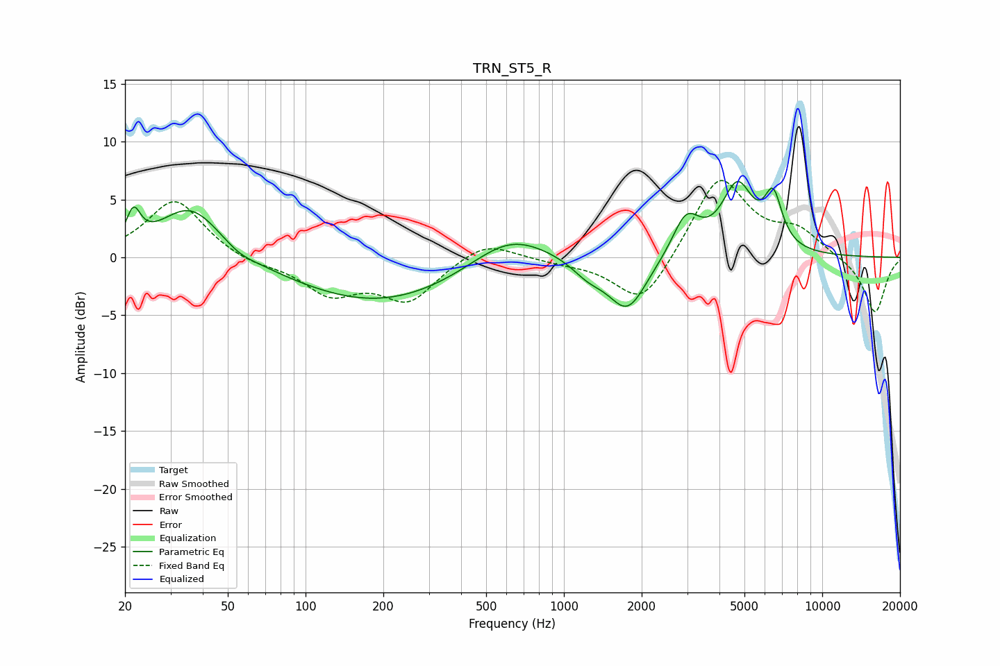

# TRN_ST5_R
See [usage instructions](https://github.com/jaakkopasanen/AutoEq#usage) for more options and info.

### Parametric EQs
Apply preamp of -6.7 dB when using parametric equalizer.

|   # | Type    |   Fc (Hz) |    Q |   Gain (dB) |
|-----|---------|-----------|------|-------------|
|   1 | Peaking |        22 | 5.32 |         2.8 |
|   2 | Peaking |        36 | 1.17 |         4.7 |
|   3 | Peaking |        55 | 2.61 |        -0.5 |
|   4 | Peaking |       193 | 0.43 |        -4   |
|   5 | Peaking |       617 | 0.92 |         2.9 |
|   6 | Peaking |      1243 | 2.22 |        -1.2 |
|   7 | Peaking |      1763 | 1.87 |        -4.6 |
|   8 | Peaking |      2973 | 2.66 |         3.5 |
|   9 | Peaking |      4699 | 2.27 |         5.9 |
|  10 | Peaking |      6460 | 4.01 |         4.3 |

### Fixed Band EQs
When using fixed band (also called graphic) equalizer, apply preamp of **-6.7 dB** (if available) and set gains manually with these parameters.

|   # | Type    |   Fc (Hz) |    Q |   Gain (dB) |
|-----|---------|-----------|------|-------------|
|   1 | Peaking |        31 | 1.41 |         5   |
|   2 | Peaking |        62 | 1.41 |        -0.6 |
|   3 | Peaking |       125 | 1.41 |        -2.9 |
|   4 | Peaking |       250 | 1.41 |        -3.6 |
|   5 | Peaking |       500 | 1.41 |         1.6 |
|   6 | Peaking |      1000 | 1.41 |        -0.3 |
|   7 | Peaking |      2000 | 1.41 |        -4.4 |
|   8 | Peaking |      4000 | 1.41 |         7.1 |
|   9 | Peaking |      8000 | 1.41 |         2.1 |
|  10 | Peaking |     16000 | 1.41 |        -4.9 |

### Graphs

