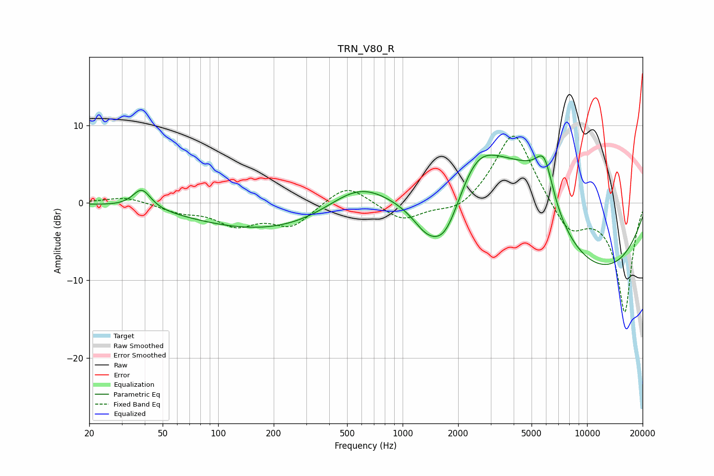

# TRN_V80_R
See [usage instructions](https://github.com/jaakkopasanen/AutoEq#usage) for more options and info.

### Parametric EQs
Apply preamp of -6.2 dB when using parametric equalizer.

|   # | Type    |   Fc (Hz) |    Q |   Gain (dB) |
|-----|---------|-----------|------|-------------|
|   1 | Peaking |        39 | 2.94 |         2.6 |
|   2 | Peaking |       210 | 0.32 |        -3.8 |
|   3 | Peaking |       580 | 0.78 |         4.3 |
|   4 | Peaking |      1328 | 2    |        -1.9 |
|   5 | Peaking |      1693 | 1.46 |        -6.8 |
|   6 | Peaking |      2502 | 1.07 |         7   |
|   7 | Peaking |      3893 | 0.58 |         8.9 |
|   8 | Peaking |      5189 | 1.08 |         3.9 |
|   9 | Peaking |      5872 | 2.9  |         5.1 |
|  10 | Peaking |      8150 | 0.24 |       -11.3 |

### Fixed Band EQs
When using fixed band (also called graphic) equalizer, apply preamp of **-8.7 dB** (if available) and set gains manually with these parameters.

|   # | Type    |   Fc (Hz) |    Q |   Gain (dB) |
|-----|---------|-----------|------|-------------|
|   1 | Peaking |        31 | 1.41 |         0.8 |
|   2 | Peaking |        62 | 1.41 |        -1   |
|   3 | Peaking |       125 | 1.41 |        -2.6 |
|   4 | Peaking |       250 | 1.41 |        -2.9 |
|   5 | Peaking |       500 | 1.41 |         2.6 |
|   6 | Peaking |      1000 | 1.41 |        -2.4 |
|   7 | Peaking |      2000 | 1.41 |        -1.5 |
|   8 | Peaking |      4000 | 1.41 |         9.7 |
|   9 | Peaking |      8000 | 1.41 |        -3.9 |
|  10 | Peaking |     16000 | 1.41 |       -14.1 |

### Graphs

