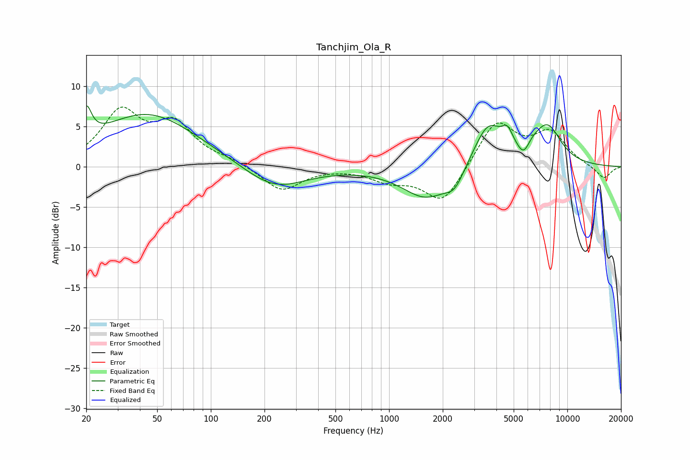

# Tanchjim_Ola_R
See [usage instructions](https://github.com/jaakkopasanen/AutoEq#usage) for more options and info.

### Parametric EQs
Apply preamp of -7.6 dB when using parametric equalizer.

|   # | Type    |   Fc (Hz) |    Q |   Gain (dB) |
|-----|---------|-----------|------|-------------|
|   1 | Peaking |        20 | 4.95 |         3.9 |
|   2 | Peaking |        44 | 0.5  |         6.6 |
|   3 | Peaking |       226 | 0.82 |        -3   |
|   4 | Peaking |      1621 | 1.05 |        -4   |
|   5 | Peaking |      2332 | 2.7  |        -2   |
|   6 | Peaking |      3587 | 1.69 |         5.4 |
|   7 | Peaking |      4611 | 4.6  |         1.9 |
|   8 | Peaking |      5720 | 3.52 |        -3.2 |
|   9 | Peaking |      5925 | 2.4  |         2.3 |
|  10 | Peaking |      7754 | 1.72 |         4.6 |

### Fixed Band EQs
When using fixed band (also called graphic) equalizer, apply preamp of **-7.5 dB** (if available) and set gains manually with these parameters.

|   # | Type    |   Fc (Hz) |    Q |   Gain (dB) |
|-----|---------|-----------|------|-------------|
|   1 | Peaking |        31 | 1.41 |         6.5 |
|   2 | Peaking |        62 | 1.41 |         4.8 |
|   3 | Peaking |       125 | 1.41 |         0.6 |
|   4 | Peaking |       250 | 1.41 |        -3   |
|   5 | Peaking |       500 | 1.41 |        -0   |
|   6 | Peaking |      1000 | 1.41 |        -1.5 |
|   7 | Peaking |      2000 | 1.41 |        -4.7 |
|   8 | Peaking |      4000 | 1.41 |         5.7 |
|   9 | Peaking |      8000 | 1.41 |         4   |
|  10 | Peaking |     16000 | 1.41 |        -1.6 |

### Graphs

