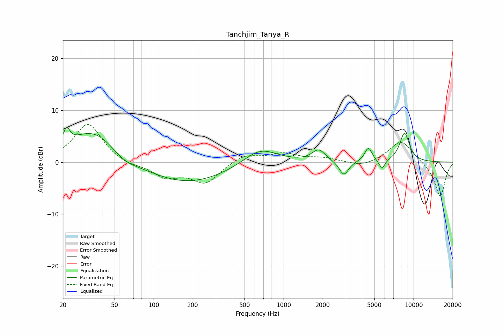

# Tanchjim_Tanya_R
See [usage instructions](https://github.com/jaakkopasanen/AutoEq#usage) for more options and info.

### Parametric EQs
Apply preamp of -6.8 dB when using parametric equalizer.

|   # | Type    |   Fc (Hz) |    Q |   Gain (dB) |
|-----|---------|-----------|------|-------------|
|   1 | Peaking |        21 | 5.71 |         2.9 |
|   2 | Peaking |        35 | 0.72 |         6.6 |
|   3 | Peaking |        59 | 1.33 |        -1.8 |
|   4 | Peaking |       176 | 0.44 |        -4.2 |
|   5 | Peaking |       658 | 1.08 |         3.2 |
|   6 | Peaking |      1862 | 2.77 |         2.3 |
|   7 | Peaking |      2908 | 3.95 |        -2.8 |
|   8 | Peaking |      4492 | 4.86 |         2.7 |
|   9 | Peaking |      5713 | 5.74 |        -1.8 |
|  10 | Peaking |      8519 | 3.38 |         5.6 |

### Fixed Band EQs
When using fixed band (also called graphic) equalizer, apply preamp of **-7.4 dB** (if available) and set gains manually with these parameters.

|   # | Type    |   Fc (Hz) |    Q |   Gain (dB) |
|-----|---------|-----------|------|-------------|
|   1 | Peaking |        31 | 1.41 |         7.5 |
|   2 | Peaking |        62 | 1.41 |        -0.8 |
|   3 | Peaking |       125 | 1.41 |        -2.7 |
|   4 | Peaking |       250 | 1.41 |        -3.9 |
|   5 | Peaking |       500 | 1.41 |         1.6 |
|   6 | Peaking |      1000 | 1.41 |         1.6 |
|   7 | Peaking |      2000 | 1.41 |         0.7 |
|   8 | Peaking |      4000 | 1.41 |        -1   |
|   9 | Peaking |      8000 | 1.41 |         4.3 |
|  10 | Peaking |     16000 | 1.41 |        -6.7 |

### Graphs

