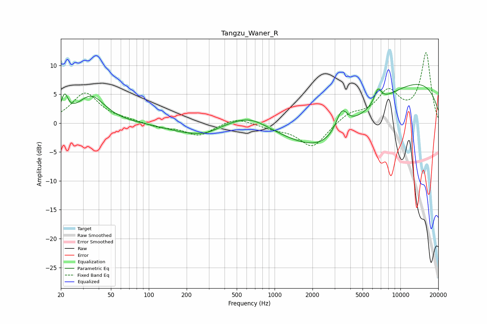

# Tangzu_Waner_R
See [usage instructions](https://github.com/jaakkopasanen/AutoEq#usage) for more options and info.

### Parametric EQs
Apply preamp of -6.8 dB when using parametric equalizer.

|   # | Type    |   Fc (Hz) |    Q |   Gain (dB) |
|-----|---------|-----------|------|-------------|
|   1 | Peaking |        21 | 5.45 |         3.4 |
|   2 | Peaking |        35 | 1.31 |         4.6 |
|   3 | Peaking |       213 | 0.76 |        -1.6 |
|   4 | Peaking |       288 | 1.7  |        -0.6 |
|   5 | Peaking |       632 | 0.92 |         2.2 |
|   6 | Peaking |      2432 | 0.73 |        -2.3 |
|   7 | Peaking |      3150 | 0.34 |        -5.7 |
|   8 | Peaking |      3422 | 3.03 |         3.9 |
|   9 | Peaking |      6626 | 4.67 |         2.5 |
|  10 | Peaking |      9955 | 0.22 |         8.3 |

### Fixed Band EQs
When using fixed band (also called graphic) equalizer, apply preamp of **-12.3 dB** (if available) and set gains manually with these parameters.

|   # | Type    |   Fc (Hz) |    Q |   Gain (dB) |
|-----|---------|-----------|------|-------------|
|   1 | Peaking |        31 | 1.41 |         5.2 |
|   2 | Peaking |        62 | 1.41 |         0.4 |
|   3 | Peaking |       125 | 1.41 |        -0.7 |
|   4 | Peaking |       250 | 1.41 |        -2.1 |
|   5 | Peaking |       500 | 1.41 |         1.1 |
|   6 | Peaking |      1000 | 1.41 |        -0.8 |
|   7 | Peaking |      2000 | 1.41 |        -4.2 |
|   8 | Peaking |      4000 | 1.41 |         1.6 |
|   9 | Peaking |      8000 | 1.41 |         5.1 |
|  10 | Peaking |     16000 | 1.41 |        12   |

### Graphs

