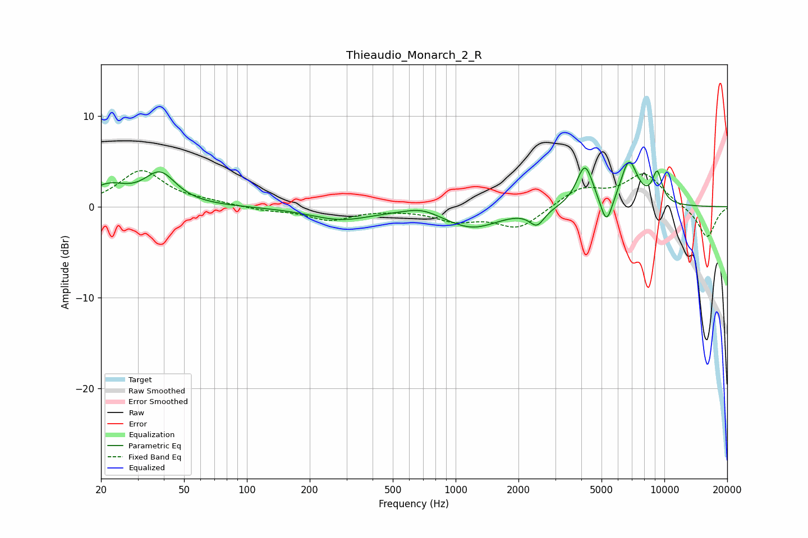

# Thieaudio_Monarch_2_R
See [usage instructions](https://github.com/jaakkopasanen/AutoEq#usage) for more options and info.

### Parametric EQs
Apply preamp of -5.0 dB when using parametric equalizer.

|   # | Type    |   Fc (Hz) |    Q |   Gain (dB) |
|-----|---------|-----------|------|-------------|
|   1 | Peaking |        22 | 1.55 |         2   |
|   2 | Peaking |        38 | 1.88 |         3.4 |
|   3 | Peaking |       282 | 0.94 |        -1.4 |
|   4 | Peaking |       689 | 1.76 |         0.7 |
|   5 | Peaking |      1200 | 1.07 |        -2.3 |
|   6 | Peaking |      2453 | 3.98 |        -1.7 |
|   7 | Peaking |      4166 | 3.51 |         4.6 |
|   8 | Peaking |      5282 | 4.74 |        -3.3 |
|   9 | Peaking |      6772 | 3.28 |         4.9 |
|  10 | Peaking |      9244 | 5.33 |         3.3 |

### Fixed Band EQs
When using fixed band (also called graphic) equalizer, apply preamp of **-4.1 dB** (if available) and set gains manually with these parameters.

|   # | Type    |   Fc (Hz) |    Q |   Gain (dB) |
|-----|---------|-----------|------|-------------|
|   1 | Peaking |        31 | 1.41 |         3.9 |
|   2 | Peaking |        62 | 1.41 |         0.4 |
|   3 | Peaking |       125 | 1.41 |        -0.4 |
|   4 | Peaking |       250 | 1.41 |        -1.4 |
|   5 | Peaking |       500 | 1.41 |        -0.1 |
|   6 | Peaking |      1000 | 1.41 |        -1.4 |
|   7 | Peaking |      2000 | 1.41 |        -2.4 |
|   8 | Peaking |      4000 | 1.41 |         2   |
|   9 | Peaking |      8000 | 1.41 |         3.6 |
|  10 | Peaking |     16000 | 1.41 |        -3.5 |

### Graphs

