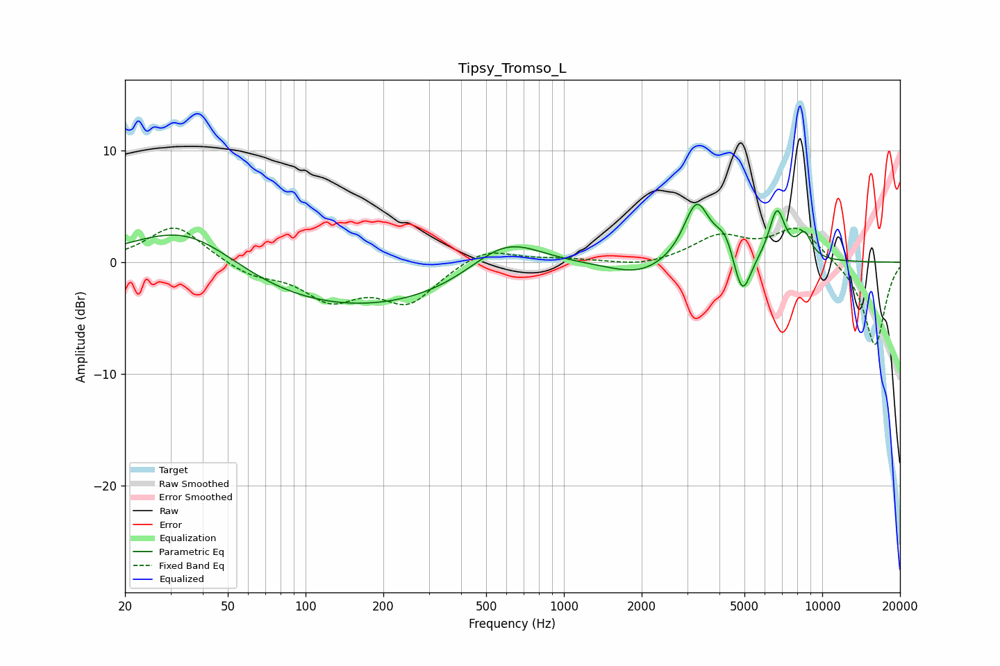

# Tipsy_Tromso_L
See [usage instructions](https://github.com/jaakkopasanen/AutoEq#usage) for more options and info.

### Parametric EQs
Apply preamp of -5.3 dB when using parametric equalizer.

|   # | Type    |   Fc (Hz) |    Q |   Gain (dB) |
|-----|---------|-----------|------|-------------|
|   1 | Peaking |        35 | 0.67 |         4.8 |
|   2 | Peaking |       133 | 0.24 |        -4.5 |
|   3 | Peaking |       595 | 0.98 |         3.5 |
|   4 | Peaking |      1958 | 1.25 |        -1.2 |
|   5 | Peaking |      3265 | 2.76 |         5.4 |
|   6 | Peaking |      4233 | 3.6  |         2.3 |
|   7 | Peaking |      4653 | 2.98 |        -0.6 |
|   8 | Peaking |      4906 | 4.26 |        -3.7 |
|   9 | Peaking |      6684 | 4.32 |         4.5 |
|  10 | Peaking |      8532 | 4.57 |         2.2 |

### Fixed Band EQs
When using fixed band (also called graphic) equalizer, apply preamp of **-3.1 dB** (if available) and set gains manually with these parameters.

|   # | Type    |   Fc (Hz) |    Q |   Gain (dB) |
|-----|---------|-----------|------|-------------|
|   1 | Peaking |        31 | 1.41 |         3.4 |
|   2 | Peaking |        62 | 1.41 |        -1.1 |
|   3 | Peaking |       125 | 1.41 |        -3.1 |
|   4 | Peaking |       250 | 1.41 |        -3.4 |
|   5 | Peaking |       500 | 1.41 |         1.4 |
|   6 | Peaking |      1000 | 1.41 |         0.3 |
|   7 | Peaking |      2000 | 1.41 |        -0.5 |
|   8 | Peaking |      4000 | 1.41 |         2.2 |
|   9 | Peaking |      8000 | 1.41 |         3.1 |
|  10 | Peaking |     16000 | 1.41 |        -7.6 |

### Graphs

