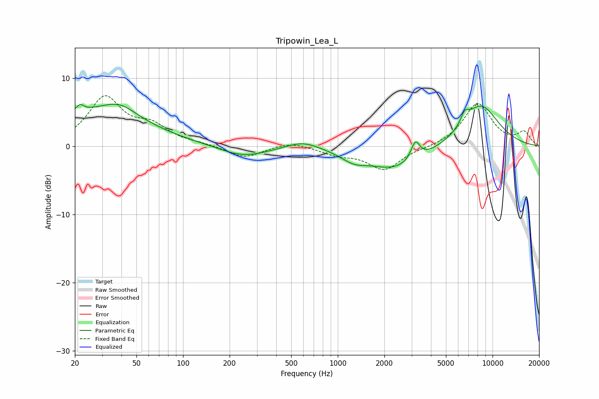

# Tripowin_Lea_L
See [usage instructions](https://github.com/jaakkopasanen/AutoEq#usage) for more options and info.

### Parametric EQs
Apply preamp of -6.3 dB when using parametric equalizer.

|   # | Type    |   Fc (Hz) |    Q |   Gain (dB) |
|-----|---------|-----------|------|-------------|
|   1 | Peaking |        22 | 6    |         1   |
|   2 | Peaking |        26 | 0.41 |         4.8 |
|   3 | Peaking |        39 | 1.34 |         1.8 |
|   4 | Peaking |       246 | 0.92 |        -1.6 |
|   5 | Peaking |       595 | 1.36 |         1.1 |
|   6 | Peaking |      1262 | 1.8  |        -1.2 |
|   7 | Peaking |      2361 | 0.74 |        -3.4 |
|   8 | Peaking |      3173 | 5.01 |         2.7 |
|   9 | Peaking |      6616 | 4.93 |         1.6 |
|  10 | Peaking |      8393 | 1.07 |         6.1 |

### Fixed Band EQs
When using fixed band (also called graphic) equalizer, apply preamp of **-7.5 dB** (if available) and set gains manually with these parameters.

|   # | Type    |   Fc (Hz) |    Q |   Gain (dB) |
|-----|---------|-----------|------|-------------|
|   1 | Peaking |        31 | 1.41 |         6.9 |
|   2 | Peaking |        62 | 1.41 |         2.5 |
|   3 | Peaking |       125 | 1.41 |         0.3 |
|   4 | Peaking |       250 | 1.41 |        -1.7 |
|   5 | Peaking |       500 | 1.41 |         0.7 |
|   6 | Peaking |      1000 | 1.41 |        -1.1 |
|   7 | Peaking |      2000 | 1.41 |        -3.4 |
|   8 | Peaking |      4000 | 1.41 |        -0.2 |
|   9 | Peaking |      8000 | 1.41 |         6.3 |
|  10 | Peaking |     16000 | 1.41 |         1.9 |

### Graphs

