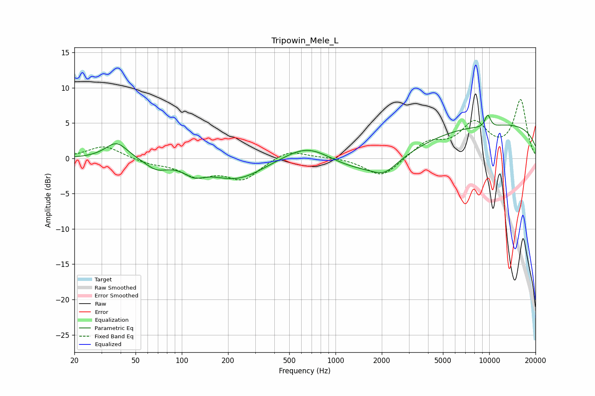

# Tripowin_Mele_L
See [usage instructions](https://github.com/jaakkopasanen/AutoEq#usage) for more options and info.

### Parametric EQs
Apply preamp of -6.2 dB when using parametric equalizer.

|   # | Type    |   Fc (Hz) |    Q |   Gain (dB) |
|-----|---------|-----------|------|-------------|
|   1 | Peaking |        38 | 1.97 |         2.4 |
|   2 | Peaking |        68 | 2.02 |        -1.3 |
|   3 | Peaking |       120 | 2.11 |        -1.4 |
|   4 | Peaking |       228 | 0.81 |        -2.9 |
|   5 | Peaking |       664 | 0.89 |         2.9 |
|   6 | Peaking |      1698 | 0.48 |        -3.3 |
|   7 | Peaking |      2083 | 1.82 |        -1.6 |
|   8 | Peaking |      9784 | 5.98 |         2.1 |
|   9 | Peaking |      9790 | 1.96 |        -0.7 |
|  10 | Peaking |     10000 | 0.18 |         5.1 |

### Fixed Band EQs
When using fixed band (also called graphic) equalizer, apply preamp of **-8.4 dB** (if available) and set gains manually with these parameters.

|   # | Type    |   Fc (Hz) |    Q |   Gain (dB) |
|-----|---------|-----------|------|-------------|
|   1 | Peaking |        31 | 1.41 |         1.8 |
|   2 | Peaking |        62 | 1.41 |        -0.6 |
|   3 | Peaking |       125 | 1.41 |        -2.3 |
|   4 | Peaking |       250 | 1.41 |        -2.8 |
|   5 | Peaking |       500 | 1.41 |         1.4 |
|   6 | Peaking |      1000 | 1.41 |         0.2 |
|   7 | Peaking |      2000 | 1.41 |        -2.8 |
|   8 | Peaking |      4000 | 1.41 |         2.2 |
|   9 | Peaking |      8000 | 1.41 |         4.7 |
|  10 | Peaking |     16000 | 1.41 |         8.1 |

### Graphs

