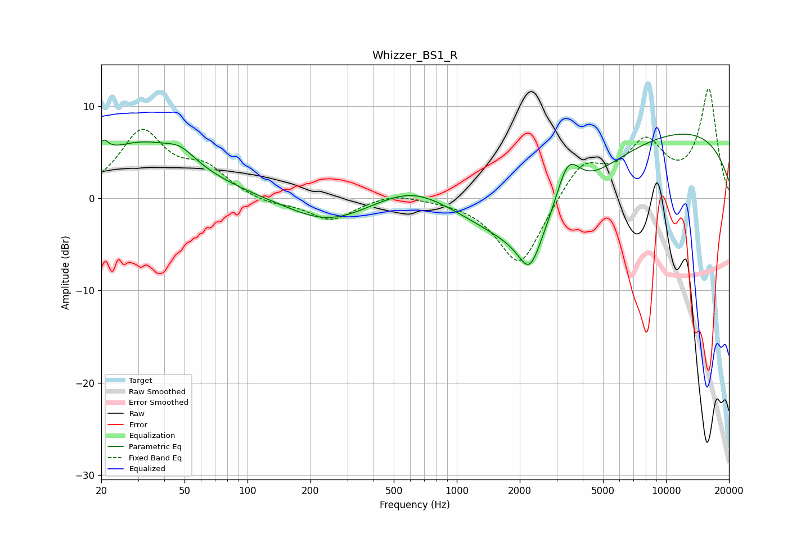

# Whizzer_BS1_R
See [usage instructions](https://github.com/jaakkopasanen/AutoEq#usage) for more options and info.

### Parametric EQs
Apply preamp of -7.1 dB when using parametric equalizer.

|   # | Type    |   Fc (Hz) |    Q |   Gain (dB) |
|-----|---------|-----------|------|-------------|
|   1 | Peaking |        20 | 5.78 |         1.6 |
|   2 | Peaking |        31 | 0.58 |         5.9 |
|   3 | Peaking |        48 | 2.12 |         1.2 |
|   4 | Peaking |       243 | 0.74 |        -2.7 |
|   5 | Peaking |       621 | 0.82 |         2.3 |
|   6 | Peaking |      2228 | 2.85 |        -3.7 |
|   7 | Peaking |      2424 | 0.55 |        -9   |
|   8 | Peaking |      3387 | 2.26 |         5.7 |
|   9 | Peaking |      8910 | 0.19 |         5.8 |
|  10 | Peaking |      9771 | 0.28 |         2.1 |

### Fixed Band EQs
When using fixed band (also called graphic) equalizer, apply preamp of **-12.0 dB** (if available) and set gains manually with these parameters.

|   # | Type    |   Fc (Hz) |    Q |   Gain (dB) |
|-----|---------|-----------|------|-------------|
|   1 | Peaking |        31 | 1.41 |         7   |
|   2 | Peaking |        62 | 1.41 |         2.8 |
|   3 | Peaking |       125 | 1.41 |        -0.7 |
|   4 | Peaking |       250 | 1.41 |        -2.4 |
|   5 | Peaking |       500 | 1.41 |         0.7 |
|   6 | Peaking |      1000 | 1.41 |        -0   |
|   7 | Peaking |      2000 | 1.41 |        -7.6 |
|   8 | Peaking |      4000 | 1.41 |         4   |
|   9 | Peaking |      8000 | 1.41 |         5.6 |
|  10 | Peaking |     16000 | 1.41 |        11.7 |

### Graphs

