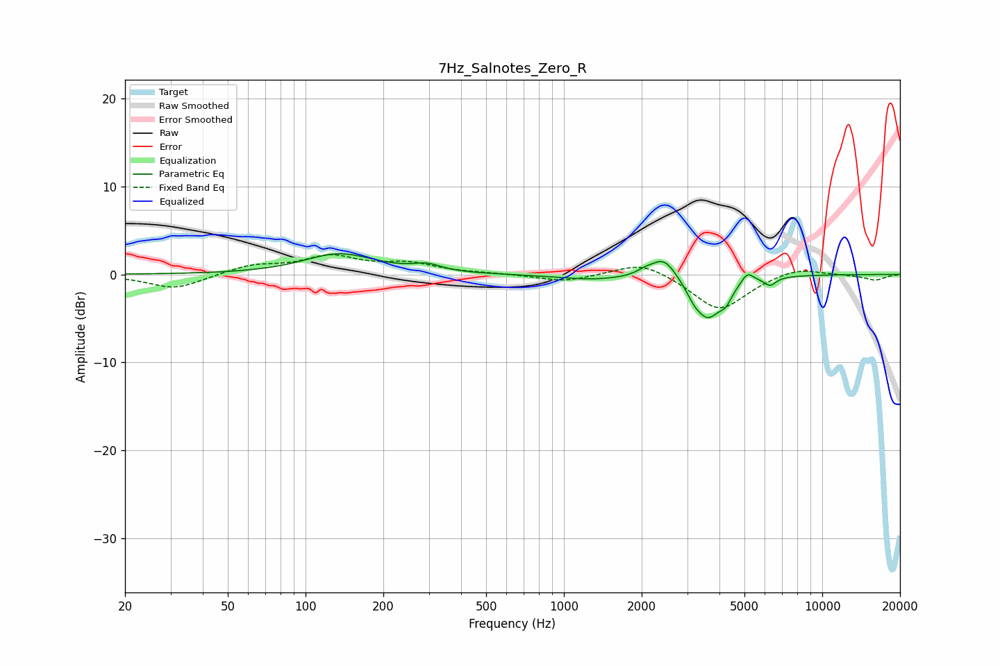

# 7Hz_Salnotes_Zero_R
See [usage instructions](https://github.com/jaakkopasanen/AutoEq#usage) for more options and info.

### Parametric EQs
Apply preamp of -2.4 dB when using parametric equalizer.

|   # | Type    |   Fc (Hz) |    Q |   Gain (dB) |
|-----|---------|-----------|------|-------------|
|   1 | Peaking |       135 | 1.03 |         2.3 |
|   2 | Peaking |       295 | 2.62 |         0.8 |
|   3 | Peaking |      1297 | 1.03 |        -0.6 |
|   4 | Peaking |      2069 | 4.09 |         0.5 |
|   5 | Peaking |      2444 | 2.89 |         2.4 |
|   6 | Peaking |      3170 | 6    |        -0.6 |
|   7 | Peaking |      3592 | 2.52 |        -4.8 |
|   8 | Peaking |      4237 | 5.9  |        -1.2 |
|   9 | Peaking |      5130 | 6    |         1.2 |
|  10 | Peaking |      6282 | 6    |        -0.9 |

### Fixed Band EQs
When using fixed band (also called graphic) equalizer, apply preamp of **-2.3 dB** (if available) and set gains manually with these parameters.

|   # | Type    |   Fc (Hz) |    Q |   Gain (dB) |
|-----|---------|-----------|------|-------------|
|   1 | Peaking |        31 | 1.41 |        -1.7 |
|   2 | Peaking |        62 | 1.41 |         1   |
|   3 | Peaking |       125 | 1.41 |         1.9 |
|   4 | Peaking |       250 | 1.41 |         1.1 |
|   5 | Peaking |       500 | 1.41 |         0.1 |
|   6 | Peaking |      1000 | 1.41 |        -0.8 |
|   7 | Peaking |      2000 | 1.41 |         1.6 |
|   8 | Peaking |      4000 | 1.41 |        -4.2 |
|   9 | Peaking |      8000 | 1.41 |         0.9 |
|  10 | Peaking |     16000 | 1.41 |        -0.6 |

### Graphs

