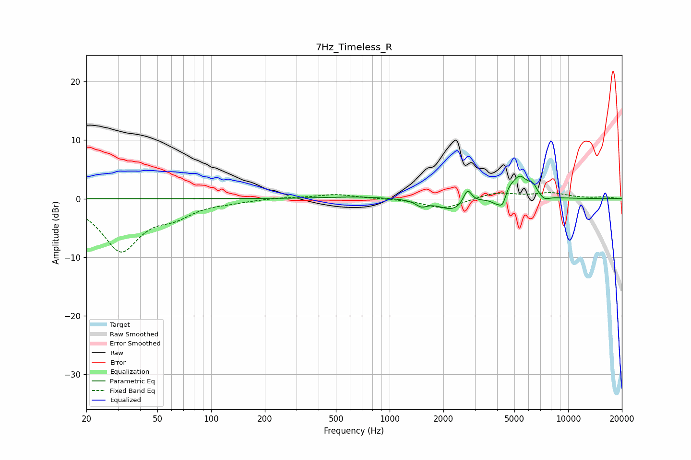

# 7Hz_Timeless_R
See [usage instructions](https://github.com/jaakkopasanen/AutoEq#usage) for more options and info.

### Parametric EQs
Apply preamp of -3.9 dB when using parametric equalizer.

|   # | Type    |   Fc (Hz) |    Q |   Gain (dB) |
|-----|---------|-----------|------|-------------|
|   1 | Peaking |       658 | 0.86 |         0.3 |
|   2 | Peaking |      1507 | 4.65 |        -1   |
|   3 | Peaking |      2281 | 1.77 |        -2.1 |
|   4 | Peaking |      2731 | 6    |         2.6 |
|   5 | Peaking |      3915 | 5.2  |        -0.7 |
|   6 | Peaking |      4304 | 6    |        -2.3 |
|   7 | Peaking |      4601 | 6    |         1.1 |
|   8 | Peaking |      5339 | 2.88 |         3.9 |
|   9 | Peaking |      6352 | 6    |         1.4 |
|  10 | Peaking |      7335 | 4.52 |        -0.8 |

### Fixed Band EQs
When using fixed band (also called graphic) equalizer, apply preamp of **-1.1 dB** (if available) and set gains manually with these parameters.

|   # | Type    |   Fc (Hz) |    Q |   Gain (dB) |
|-----|---------|-----------|------|-------------|
|   1 | Peaking |        31 | 1.41 |        -8.7 |
|   2 | Peaking |        62 | 1.41 |        -2.2 |
|   3 | Peaking |       125 | 1.41 |        -0.4 |
|   4 | Peaking |       250 | 1.41 |         0.2 |
|   5 | Peaking |       500 | 1.41 |         0.7 |
|   6 | Peaking |      1000 | 1.41 |        -0   |
|   7 | Peaking |      2000 | 1.41 |        -1.7 |
|   8 | Peaking |      4000 | 1.41 |         1.1 |
|   9 | Peaking |      8000 | 1.41 |         0.9 |
|  10 | Peaking |     16000 | 1.41 |         0.3 |

### Graphs

