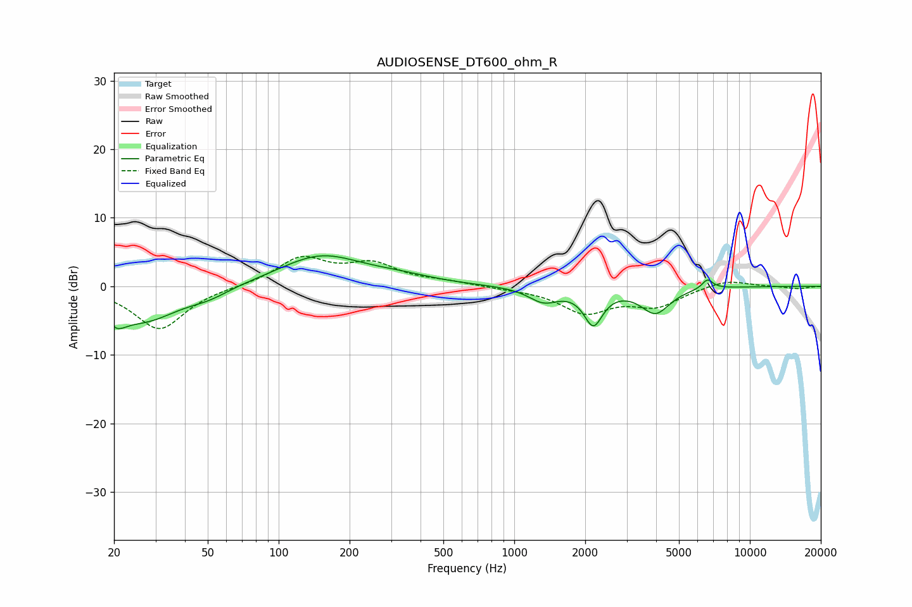

# AUDIOSENSE_DT600_ohm_R
See [usage instructions](https://github.com/jaakkopasanen/AutoEq#usage) for more options and info.

### Parametric EQs
Apply preamp of -4.5 dB when using parametric equalizer.

|   # | Type    |   Fc (Hz) |    Q |   Gain (dB) |
|-----|---------|-----------|------|-------------|
|   1 | Peaking |        21 | 4.99 |        -5.4 |
|   2 | Peaking |        21 | 5.83 |         3.3 |
|   3 | Peaking |        26 | 0.91 |        -5   |
|   4 | Peaking |        51 | 1.73 |        -1   |
|   5 | Peaking |       151 | 0.79 |         4.5 |
|   6 | Peaking |       332 | 1.01 |         0.8 |
|   7 | Peaking |      1331 | 2.22 |        -2.1 |
|   8 | Peaking |      2166 | 3.56 |        -5.1 |
|   9 | Peaking |      3972 | 2.31 |        -3.7 |
|  10 | Peaking |      6608 | 5.84 |         1.4 |

### Fixed Band EQs
When using fixed band (also called graphic) equalizer, apply preamp of **-4.5 dB** (if available) and set gains manually with these parameters.

|   # | Type    |   Fc (Hz) |    Q |   Gain (dB) |
|-----|---------|-----------|------|-------------|
|   1 | Peaking |        31 | 1.41 |        -6.3 |
|   2 | Peaking |        62 | 1.41 |        -0   |
|   3 | Peaking |       125 | 1.41 |         4   |
|   4 | Peaking |       250 | 1.41 |         3   |
|   5 | Peaking |       500 | 1.41 |         0.6 |
|   6 | Peaking |      1000 | 1.41 |        -0.3 |
|   7 | Peaking |      2000 | 1.41 |        -3.7 |
|   8 | Peaking |      4000 | 1.41 |        -2.7 |
|   9 | Peaking |      8000 | 1.41 |         1.1 |
|  10 | Peaking |     16000 | 1.41 |        -0.4 |

### Graphs

