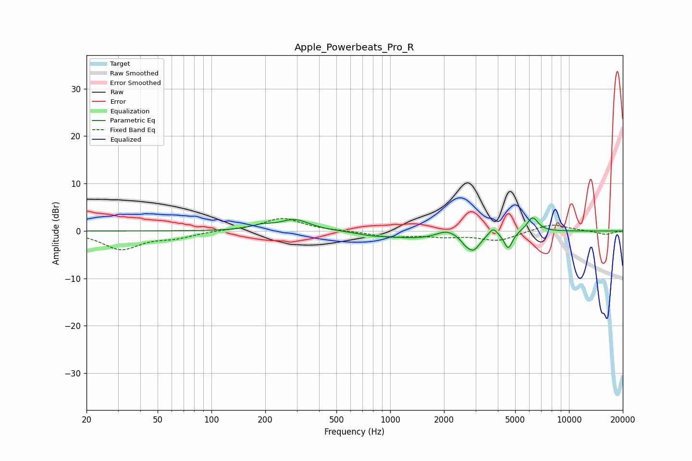

# Apple_Powerbeats_Pro_R
See [usage instructions](https://github.com/jaakkopasanen/AutoEq#usage) for more options and info.

### Parametric EQs
Apply preamp of -2.8 dB when using parametric equalizer.

|   # | Type    |   Fc (Hz) |    Q |   Gain (dB) |
|-----|---------|-----------|------|-------------|
|   1 | Peaking |       189 | 2.31 |         0.8 |
|   2 | Peaking |       292 | 1.69 |         2.3 |
|   3 | Peaking |       792 | 1.73 |        -0.6 |
|   4 | Peaking |      1401 | 0.94 |        -1.4 |
|   5 | Peaking |      2058 | 2.87 |         1.2 |
|   6 | Peaking |      2626 | 6    |        -0.8 |
|   7 | Peaking |      2916 | 3.58 |        -3.6 |
|   8 | Peaking |      3761 | 6    |         1.6 |
|   9 | Peaking |      4576 | 5.97 |        -3.6 |
|  10 | Peaking |      6257 | 4.41 |         3.1 |

### Fixed Band EQs
When using fixed band (also called graphic) equalizer, apply preamp of **-2.7 dB** (if available) and set gains manually with these parameters.

|   # | Type    |   Fc (Hz) |    Q |   Gain (dB) |
|-----|---------|-----------|------|-------------|
|   1 | Peaking |        31 | 1.41 |        -3.8 |
|   2 | Peaking |        62 | 1.41 |        -1.2 |
|   3 | Peaking |       125 | 1.41 |         0.2 |
|   4 | Peaking |       250 | 1.41 |         2.7 |
|   5 | Peaking |       500 | 1.41 |         0   |
|   6 | Peaking |      1000 | 1.41 |        -1.2 |
|   7 | Peaking |      2000 | 1.41 |        -1   |
|   8 | Peaking |      4000 | 1.41 |        -2   |
|   9 | Peaking |      8000 | 1.41 |         1.6 |
|  10 | Peaking |     16000 | 1.41 |        -0.8 |

### Graphs

