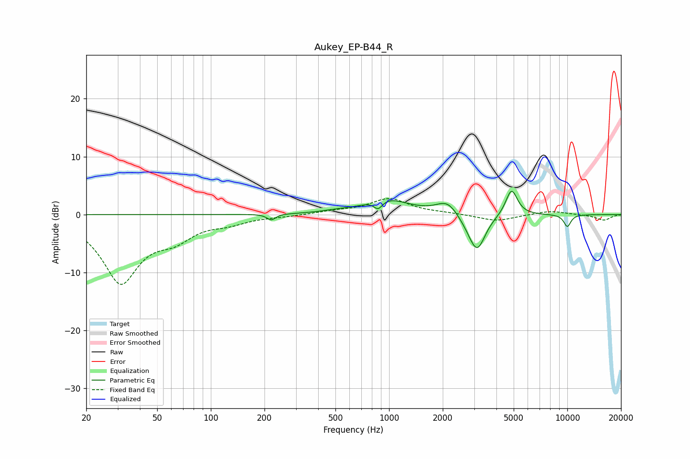

# Aukey_EP-B44_R
See [usage instructions](https://github.com/jaakkopasanen/AutoEq#usage) for more options and info.

### Parametric EQs
Apply preamp of -4.1 dB when using parametric equalizer.

|   # | Type    |   Fc (Hz) |    Q |   Gain (dB) |
|-----|---------|-----------|------|-------------|
|   1 | Peaking |       218 | 5.99 |        -1   |
|   2 | Peaking |       501 | 1.77 |         0.3 |
|   3 | Peaking |       868 | 6    |        -1.5 |
|   4 | Peaking |       965 | 1.13 |         2.6 |
|   5 | Peaking |      2011 | 2.08 |         0.4 |
|   6 | Peaking |      2139 | 2.47 |         2   |
|   7 | Peaking |      2868 | 2.4  |        -1.3 |
|   8 | Peaking |      3127 | 3.14 |        -5.5 |
|   9 | Peaking |      4864 | 4.27 |         4.6 |
|  10 | Peaking |     10000 | 6    |        -2.1 |

### Fixed Band EQs
When using fixed band (also called graphic) equalizer, apply preamp of **-2.9 dB** (if available) and set gains manually with these parameters.

|   # | Type    |   Fc (Hz) |    Q |   Gain (dB) |
|-----|---------|-----------|------|-------------|
|   1 | Peaking |        31 | 1.41 |       -11.4 |
|   2 | Peaking |        62 | 1.41 |        -3.1 |
|   3 | Peaking |       125 | 1.41 |        -1.1 |
|   4 | Peaking |       250 | 1.41 |        -0.2 |
|   5 | Peaking |       500 | 1.41 |         0.5 |
|   6 | Peaking |      1000 | 1.41 |         2.7 |
|   7 | Peaking |      2000 | 1.41 |         0.2 |
|   8 | Peaking |      4000 | 1.41 |        -1.2 |
|   9 | Peaking |      8000 | 1.41 |         0.7 |
|  10 | Peaking |     16000 | 1.41 |        -1   |

### Graphs

