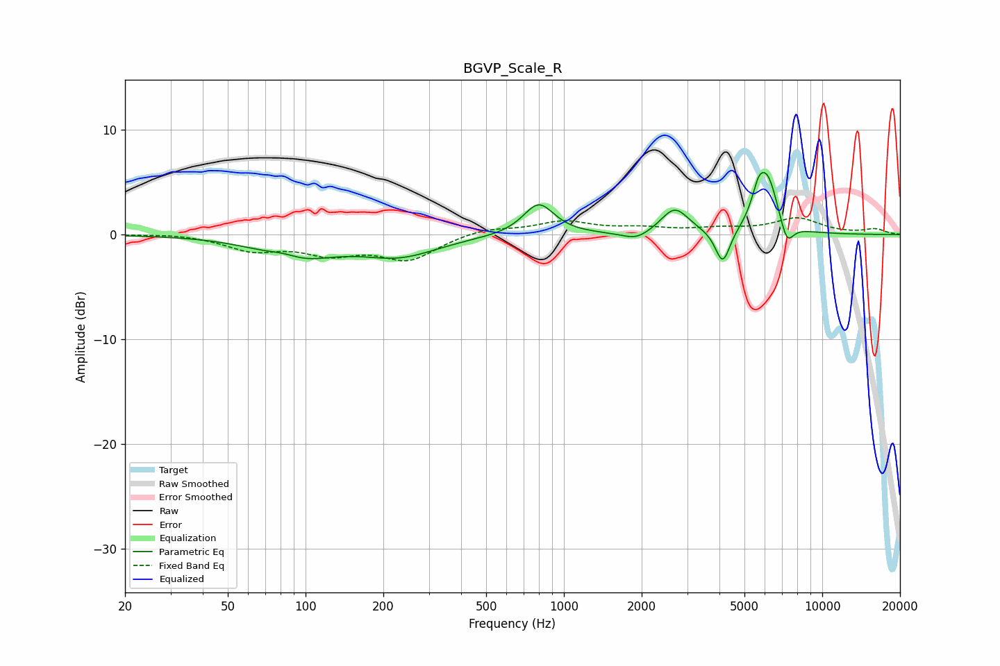

# BGVP_Scale_R
See [usage instructions](https://github.com/jaakkopasanen/AutoEq#usage) for more options and info.

### Parametric EQs
Apply preamp of -6.0 dB when using parametric equalizer.

|   # | Type    |   Fc (Hz) |    Q |   Gain (dB) |
|-----|---------|-----------|------|-------------|
|   1 | Peaking |        82 | 2.2  |         0.7 |
|   2 | Peaking |        91 | 1    |        -2.3 |
|   3 | Peaking |       231 | 0.95 |        -1.9 |
|   4 | Peaking |       799 | 2.38 |         3   |
|   5 | Peaking |      1908 | 2.59 |        -0.8 |
|   6 | Peaking |      2687 | 2.63 |         2.5 |
|   7 | Peaking |      4121 | 4.95 |        -3.3 |
|   8 | Peaking |      5653 | 5.44 |         2.2 |
|   9 | Peaking |      6150 | 3.27 |         5.1 |
|  10 | Peaking |      7293 | 5.2  |        -2.2 |

### Fixed Band EQs
When using fixed band (also called graphic) equalizer, apply preamp of **-1.7 dB** (if available) and set gains manually with these parameters.

|   # | Type    |   Fc (Hz) |    Q |   Gain (dB) |
|-----|---------|-----------|------|-------------|
|   1 | Peaking |        31 | 1.41 |         0.1 |
|   2 | Peaking |        62 | 1.41 |        -1.4 |
|   3 | Peaking |       125 | 1.41 |        -1.6 |
|   4 | Peaking |       250 | 1.41 |        -2.3 |
|   5 | Peaking |       500 | 1.41 |         0.6 |
|   6 | Peaking |      1000 | 1.41 |         1.2 |
|   7 | Peaking |      2000 | 1.41 |         0.5 |
|   8 | Peaking |      4000 | 1.41 |         0.5 |
|   9 | Peaking |      8000 | 1.41 |         1.5 |
|  10 | Peaking |     16000 | 1.41 |         0.5 |

### Graphs

