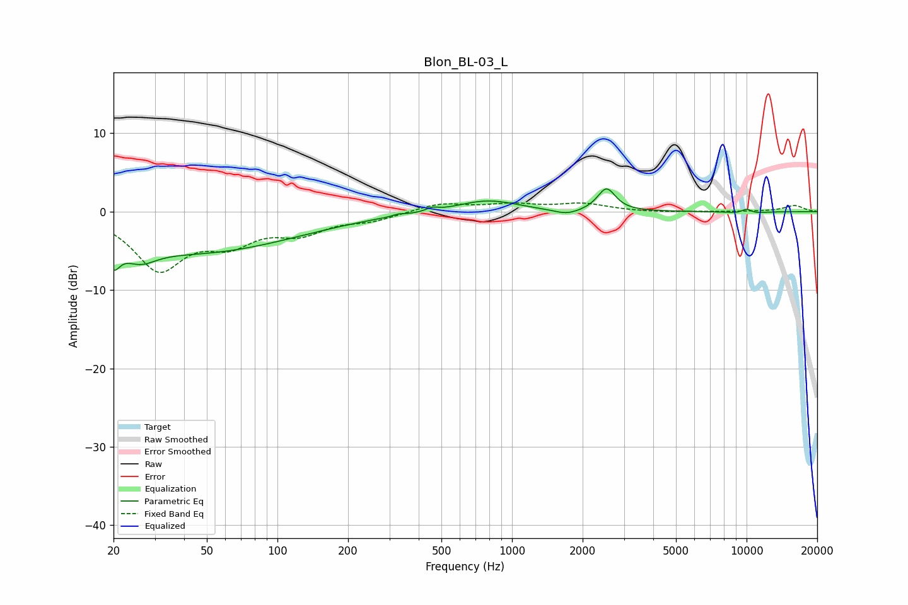

# Blon_BL-03_L
See [usage instructions](https://github.com/jaakkopasanen/AutoEq#usage) for more options and info.

### Parametric EQs
Apply preamp of -3.0 dB when using parametric equalizer.

|   # | Type    |   Fc (Hz) |    Q |   Gain (dB) |
|-----|---------|-----------|------|-------------|
|   1 | Peaking |        20 | 5.38 |        -2.8 |
|   2 | Peaking |        26 | 2.06 |        -2   |
|   3 | Peaking |        45 | 0.33 |        -5.1 |
|   4 | Peaking |       328 | 5.95 |         0.2 |
|   5 | Peaking |       456 | 5.97 |         0.4 |
|   6 | Peaking |       784 | 1.11 |         1.5 |
|   7 | Peaking |      1711 | 2.5  |        -0.7 |
|   8 | Peaking |      2528 | 3.78 |         2.9 |
|   9 | Peaking |     10000 | 2.7  |        -0.8 |
|  10 | Peaking |     10000 | 4.47 |         1   |

### Fixed Band EQs
When using fixed band (also called graphic) equalizer, apply preamp of **-1.2 dB** (if available) and set gains manually with these parameters.

|   # | Type    |   Fc (Hz) |    Q |   Gain (dB) |
|-----|---------|-----------|------|-------------|
|   1 | Peaking |        31 | 1.41 |        -7.1 |
|   2 | Peaking |        62 | 1.41 |        -3.3 |
|   3 | Peaking |       125 | 1.41 |        -2.4 |
|   4 | Peaking |       250 | 1.41 |        -1   |
|   5 | Peaking |       500 | 1.41 |         1.1 |
|   6 | Peaking |      1000 | 1.41 |         0.8 |
|   7 | Peaking |      2000 | 1.41 |         0.9 |
|   8 | Peaking |      4000 | 1.41 |        -0.1 |
|   9 | Peaking |      8000 | 1.41 |        -0   |
|  10 | Peaking |     16000 | 1.41 |         0.8 |

### Graphs

