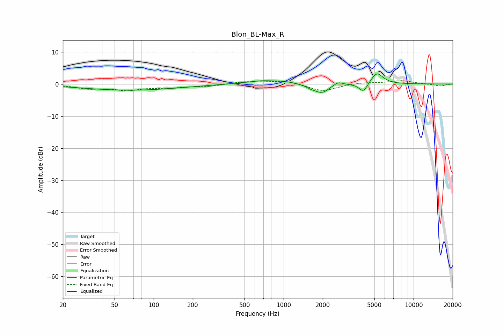

# Blon_BL-Max_R
See [usage instructions](https://github.com/jaakkopasanen/AutoEq#usage) for more options and info.

### Parametric EQs
Apply preamp of -3.2 dB when using parametric equalizer.

|   # | Type    |   Fc (Hz) |    Q |   Gain (dB) |
|-----|---------|-----------|------|-------------|
|   1 | Peaking |        32 | 1.19 |        -0   |
|   2 | Peaking |        66 | 0.37 |        -1.9 |
|   3 | Peaking |       555 | 2.67 |        -0.2 |
|   4 | Peaking |       646 | 1.12 |         1.2 |
|   5 | Peaking |      1031 | 1.88 |         0.5 |
|   6 | Peaking |      1619 | 4.03 |        -0.6 |
|   7 | Peaking |      1969 | 2.46 |        -2.8 |
|   8 | Peaking |      2617 | 3.99 |         1.2 |
|   9 | Peaking |      4112 | 4.29 |        -3   |
|  10 | Peaking |      5218 | 2.98 |         3.7 |

### Fixed Band EQs
When using fixed band (also called graphic) equalizer, apply preamp of **-1.1 dB** (if available) and set gains manually with these parameters.

|   # | Type    |   Fc (Hz) |    Q |   Gain (dB) |
|-----|---------|-----------|------|-------------|
|   1 | Peaking |        31 | 1.41 |        -1.3 |
|   2 | Peaking |        62 | 1.41 |        -1.7 |
|   3 | Peaking |       125 | 1.41 |        -1   |
|   4 | Peaking |       250 | 1.41 |        -0.7 |
|   5 | Peaking |       500 | 1.41 |         0.7 |
|   6 | Peaking |      1000 | 1.41 |         1.1 |
|   7 | Peaking |      2000 | 1.41 |        -2.3 |
|   8 | Peaking |      4000 | 1.41 |         0.5 |
|   9 | Peaking |      8000 | 1.41 |         1   |
|  10 | Peaking |     16000 | 1.41 |        -0.7 |

### Graphs

