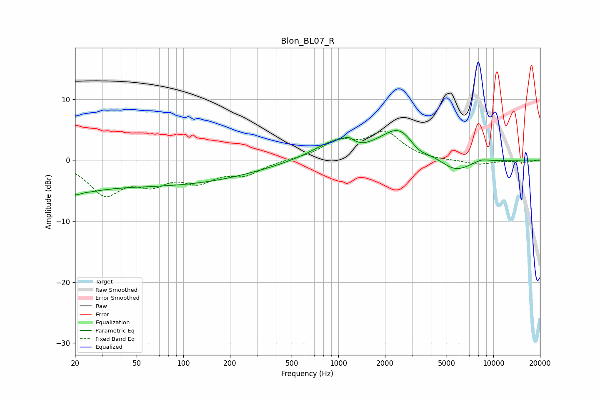

# Blon_BL07_R
See [usage instructions](https://github.com/jaakkopasanen/AutoEq#usage) for more options and info.

### Parametric EQs
Apply preamp of -5.0 dB when using parametric equalizer.

|   # | Type    |   Fc (Hz) |    Q |   Gain (dB) |
|-----|---------|-----------|------|-------------|
|   1 | Peaking |        20 | 4.65 |        -0.8 |
|   2 | Peaking |        22 | 1.17 |        -1.3 |
|   3 | Peaking |        54 | 0.18 |        -4.2 |
|   4 | Peaking |       968 | 0.97 |         3   |
|   5 | Peaking |      1159 | 5.49 |         0.6 |
|   6 | Peaking |      1432 | 2.49 |        -0.5 |
|   7 | Peaking |      2503 | 1.18 |         5.1 |
|   8 | Peaking |      3243 | 2.24 |        -1.5 |
|   9 | Peaking |      5682 | 1.43 |        -2.2 |
|  10 | Peaking |      8378 | 2.91 |         0.5 |

### Fixed Band EQs
When using fixed band (also called graphic) equalizer, apply preamp of **-4.9 dB** (if available) and set gains manually with these parameters.

|   # | Type    |   Fc (Hz) |    Q |   Gain (dB) |
|-----|---------|-----------|------|-------------|
|   1 | Peaking |        31 | 1.41 |        -5.3 |
|   2 | Peaking |        62 | 1.41 |        -3.1 |
|   3 | Peaking |       125 | 1.41 |        -3   |
|   4 | Peaking |       250 | 1.41 |        -2.1 |
|   5 | Peaking |       500 | 1.41 |         0.1 |
|   6 | Peaking |      1000 | 1.41 |         2.8 |
|   7 | Peaking |      2000 | 1.41 |         4.3 |
|   8 | Peaking |      4000 | 1.41 |        -0.1 |
|   9 | Peaking |      8000 | 1.41 |        -0.7 |
|  10 | Peaking |     16000 | 1.41 |        -0.3 |

### Graphs

