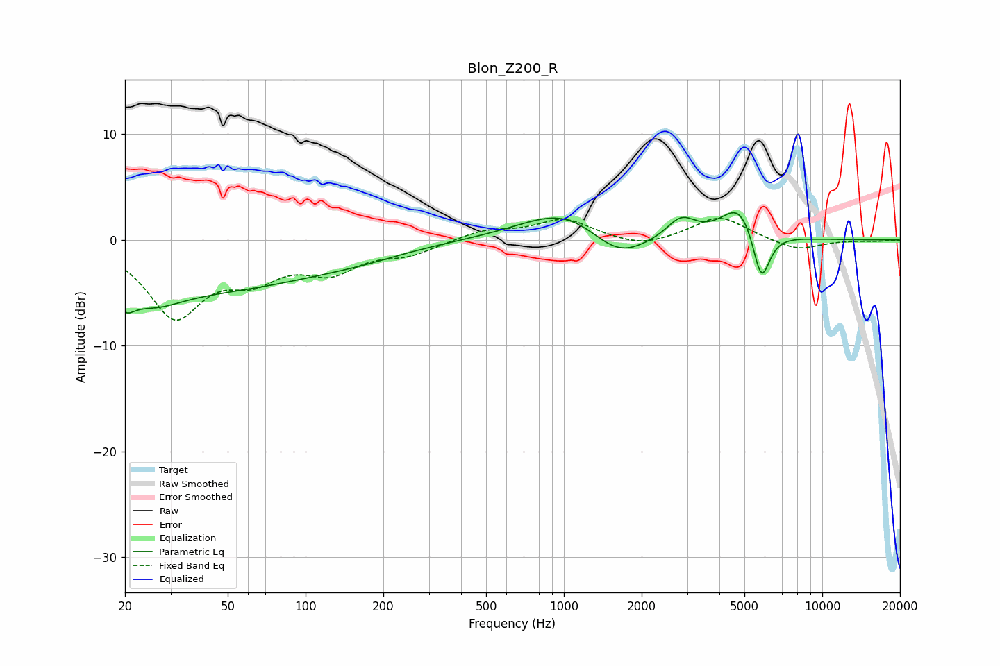

# Blon_Z200_R
See [usage instructions](https://github.com/jaakkopasanen/AutoEq#usage) for more options and info.

### Parametric EQs
Apply preamp of -2.7 dB when using parametric equalizer.

|   # | Type    |   Fc (Hz) |    Q |   Gain (dB) |
|-----|---------|-----------|------|-------------|
|   1 | Peaking |        20 | 4.17 |        -1.6 |
|   2 | Peaking |        26 | 1.33 |        -1.7 |
|   3 | Peaking |        38 | 0.27 |        -4.6 |
|   4 | Peaking |       167 | 0.93 |        -0.4 |
|   5 | Peaking |       598 | 5.57 |        -0   |
|   6 | Peaking |      1030 | 0.82 |         3.2 |
|   7 | Peaking |      1617 | 1.23 |        -2.9 |
|   8 | Peaking |      2844 | 2.55 |         1.9 |
|   9 | Peaking |      4790 | 2.02 |         3.4 |
|  10 | Peaking |      5810 | 4.11 |        -5.1 |

### Fixed Band EQs
When using fixed band (also called graphic) equalizer, apply preamp of **-2.1 dB** (if available) and set gains manually with these parameters.

|   # | Type    |   Fc (Hz) |    Q |   Gain (dB) |
|-----|---------|-----------|------|-------------|
|   1 | Peaking |        31 | 1.41 |        -6.9 |
|   2 | Peaking |        62 | 1.41 |        -2.9 |
|   3 | Peaking |       125 | 1.41 |        -2.6 |
|   4 | Peaking |       250 | 1.41 |        -1.2 |
|   5 | Peaking |       500 | 1.41 |         0.9 |
|   6 | Peaking |      1000 | 1.41 |         1.9 |
|   7 | Peaking |      2000 | 1.41 |        -0.8 |
|   8 | Peaking |      4000 | 1.41 |         2.3 |
|   9 | Peaking |      8000 | 1.41 |        -1   |
|  10 | Peaking |     16000 | 1.41 |        -0.1 |

### Graphs

