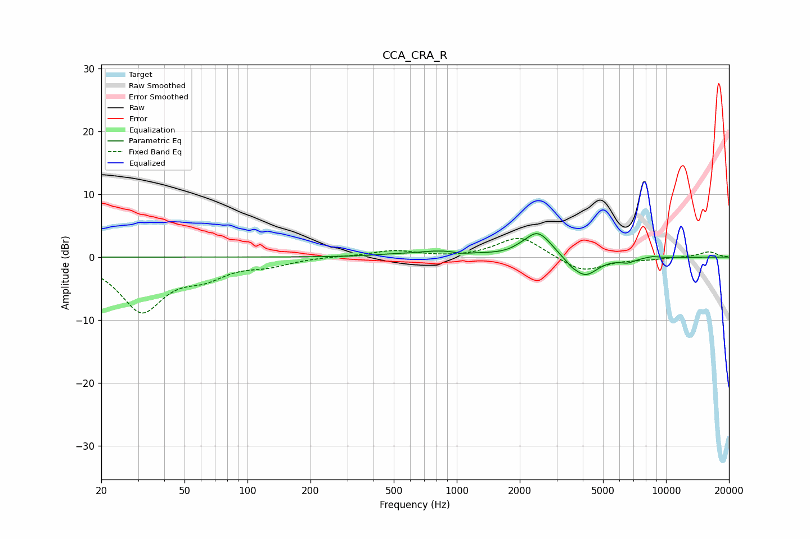

# CCA_CRA_R
See [usage instructions](https://github.com/jaakkopasanen/AutoEq#usage) for more options and info.

### Parametric EQs
Apply preamp of -3.8 dB when using parametric equalizer.

|   # | Type    |   Fc (Hz) |    Q |   Gain (dB) |
|-----|---------|-----------|------|-------------|
|   1 | Peaking |       470 | 1.77 |         0.2 |
|   2 | Peaking |       863 | 1.08 |         1   |
|   3 | Peaking |      1051 | 3.47 |        -0.3 |
|   4 | Peaking |      1998 | 4.12 |         0.3 |
|   5 | Peaking |      2414 | 2.41 |         3.7 |
|   6 | Peaking |      2744 | 3.38 |         0.5 |
|   7 | Peaking |      3517 | 6    |        -0.4 |
|   8 | Peaking |      4093 | 2.3  |        -3.2 |
|   9 | Peaking |      6554 | 3.88 |        -0.6 |
|  10 | Peaking |      8604 | 4.15 |         0.2 |

### Fixed Band EQs
When using fixed band (also called graphic) equalizer, apply preamp of **-3.1 dB** (if available) and set gains manually with these parameters.

|   # | Type    |   Fc (Hz) |    Q |   Gain (dB) |
|-----|---------|-----------|------|-------------|
|   1 | Peaking |        31 | 1.41 |        -8.4 |
|   2 | Peaking |        62 | 1.41 |        -2.4 |
|   3 | Peaking |       125 | 1.41 |        -1.1 |
|   4 | Peaking |       250 | 1.41 |         0.1 |
|   5 | Peaking |       500 | 1.41 |         1   |
|   6 | Peaking |      1000 | 1.41 |        -0.1 |
|   7 | Peaking |      2000 | 1.41 |         3.4 |
|   8 | Peaking |      4000 | 1.41 |        -2.4 |
|   9 | Peaking |      8000 | 1.41 |        -0.3 |
|  10 | Peaking |     16000 | 1.41 |         0.9 |

### Graphs

