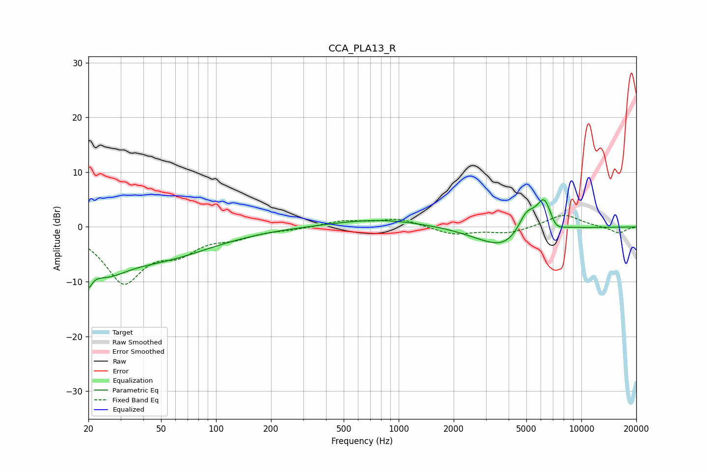

# CCA_PLA13_R
See [usage instructions](https://github.com/jaakkopasanen/AutoEq#usage) for more options and info.

### Parametric EQs
Apply preamp of -5.0 dB when using parametric equalizer.

|   # | Type    |   Fc (Hz) |    Q |   Gain (dB) |
|-----|---------|-----------|------|-------------|
|   1 | Peaking |        20 | 4.6  |        -8.7 |
|   2 | Peaking |        20 | 4.4  |         4.2 |
|   3 | Peaking |        25 | 1.17 |        -5   |
|   4 | Peaking |        49 | 0.48 |        -5.2 |
|   5 | Peaking |       782 | 0.57 |         1.4 |
|   6 | Peaking |      2684 | 1.17 |        -0.2 |
|   7 | Peaking |      3877 | 0.97 |        -4.2 |
|   8 | Peaking |      4997 | 2.84 |         4.1 |
|   9 | Peaking |      6288 | 2.95 |         6.4 |
|  10 | Peaking |      7162 | 3.36 |        -2   |

### Fixed Band EQs
When using fixed band (also called graphic) equalizer, apply preamp of **-2.2 dB** (if available) and set gains manually with these parameters.

|   # | Type    |   Fc (Hz) |    Q |   Gain (dB) |
|-----|---------|-----------|------|-------------|
|   1 | Peaking |        31 | 1.41 |        -9.7 |
|   2 | Peaking |        62 | 1.41 |        -3.7 |
|   3 | Peaking |       125 | 1.41 |        -1.5 |
|   4 | Peaking |       250 | 1.41 |        -0.4 |
|   5 | Peaking |       500 | 1.41 |         1.1 |
|   6 | Peaking |      1000 | 1.41 |         1.5 |
|   7 | Peaking |      2000 | 1.41 |        -1.4 |
|   8 | Peaking |      4000 | 1.41 |        -1.1 |
|   9 | Peaking |      8000 | 1.41 |         2.3 |
|  10 | Peaking |     16000 | 1.41 |        -1.2 |

### Graphs

