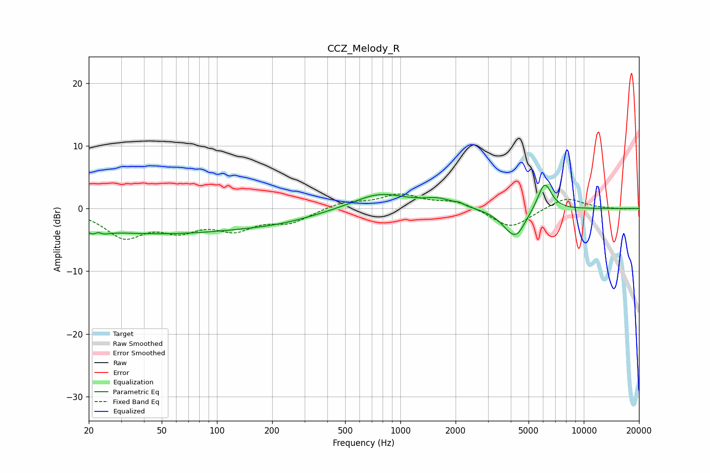

# CCZ_Melody_R
See [usage instructions](https://github.com/jaakkopasanen/AutoEq#usage) for more options and info.

### Parametric EQs
Apply preamp of -3.8 dB when using parametric equalizer.

|   # | Type    |   Fc (Hz) |    Q |   Gain (dB) |
|-----|---------|-----------|------|-------------|
|   1 | Peaking |        22 | 4.54 |        -3.7 |
|   2 | Peaking |        22 | 5.74 |         3.2 |
|   3 | Peaking |        46 | 0.26 |        -3.9 |
|   4 | Peaking |       228 | 0.66 |        -1.1 |
|   5 | Peaking |       771 | 0.96 |         2.5 |
|   6 | Peaking |      1618 | 1.75 |         1.2 |
|   7 | Peaking |      2097 | 5.99 |         0.4 |
|   8 | Peaking |      4140 | 2.12 |        -4   |
|   9 | Peaking |      4374 | 3.96 |        -0.9 |
|  10 | Peaking |      6109 | 3.55 |         4.6 |

### Fixed Band EQs
When using fixed band (also called graphic) equalizer, apply preamp of **-2.4 dB** (if available) and set gains manually with these parameters.

|   # | Type    |   Fc (Hz) |    Q |   Gain (dB) |
|-----|---------|-----------|------|-------------|
|   1 | Peaking |        31 | 1.41 |        -4.3 |
|   2 | Peaking |        62 | 1.41 |        -2.9 |
|   3 | Peaking |       125 | 1.41 |        -2.9 |
|   4 | Peaking |       250 | 1.41 |        -2   |
|   5 | Peaking |       500 | 1.41 |         1.1 |
|   6 | Peaking |      1000 | 1.41 |         2.1 |
|   7 | Peaking |      2000 | 1.41 |         1.2 |
|   8 | Peaking |      4000 | 1.41 |        -3.2 |
|   9 | Peaking |      8000 | 1.41 |         1.9 |
|  10 | Peaking |     16000 | 1.41 |        -0.1 |

### Graphs

