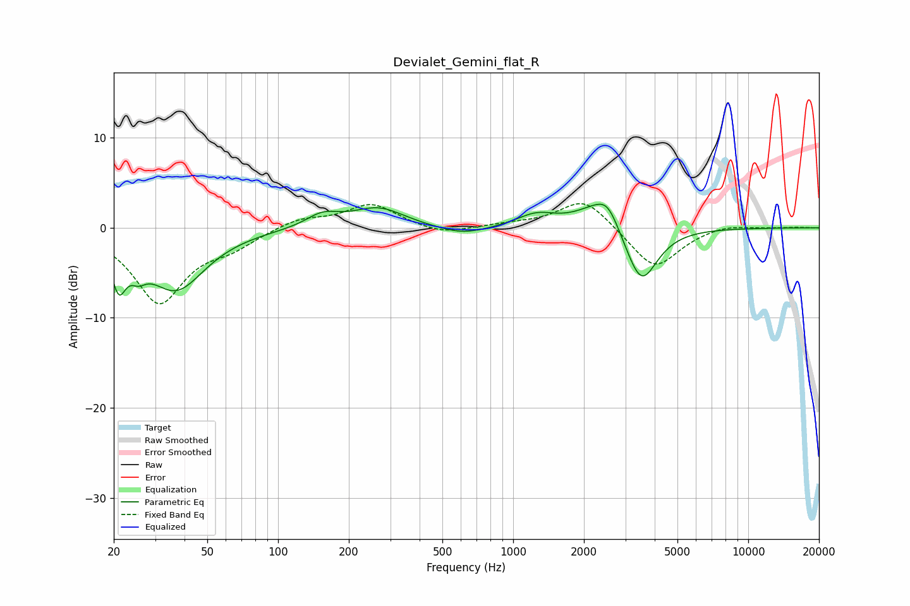

# Devialet_Gemini_flat_R
See [usage instructions](https://github.com/jaakkopasanen/AutoEq#usage) for more options and info.

### Parametric EQs
Apply preamp of -2.7 dB when using parametric equalizer.

|   # | Type    |   Fc (Hz) |    Q |   Gain (dB) |
|-----|---------|-----------|------|-------------|
|   1 | Peaking |        21 | 4.76 |        -4.5 |
|   2 | Peaking |        25 | 4.19 |        -1.6 |
|   3 | Peaking |        37 | 1.14 |        -6.7 |
|   4 | Peaking |       155 | 2.03 |         1.4 |
|   5 | Peaking |       267 | 1.26 |         2.2 |
|   6 | Peaking |       609 | 1.34 |        -1   |
|   7 | Peaking |      1256 | 1.69 |         1.4 |
|   8 | Peaking |      2289 | 1.49 |         2.5 |
|   9 | Peaking |      2532 | 3.05 |         2   |
|  10 | Peaking |      3504 | 2.05 |        -6.6 |

### Fixed Band EQs
When using fixed band (also called graphic) equalizer, apply preamp of **-2.8 dB** (if available) and set gains manually with these parameters.

|   # | Type    |   Fc (Hz) |    Q |   Gain (dB) |
|-----|---------|-----------|------|-------------|
|   1 | Peaking |        31 | 1.41 |        -8.2 |
|   2 | Peaking |        62 | 1.41 |        -1.6 |
|   3 | Peaking |       125 | 1.41 |         1.1 |
|   4 | Peaking |       250 | 1.41 |         2.6 |
|   5 | Peaking |       500 | 1.41 |        -0.8 |
|   6 | Peaking |      1000 | 1.41 |         0.3 |
|   7 | Peaking |      2000 | 1.41 |         3.4 |
|   8 | Peaking |      4000 | 1.41 |        -4.7 |
|   9 | Peaking |      8000 | 1.41 |         0.5 |
|  10 | Peaking |     16000 | 1.41 |         0.1 |

### Graphs

