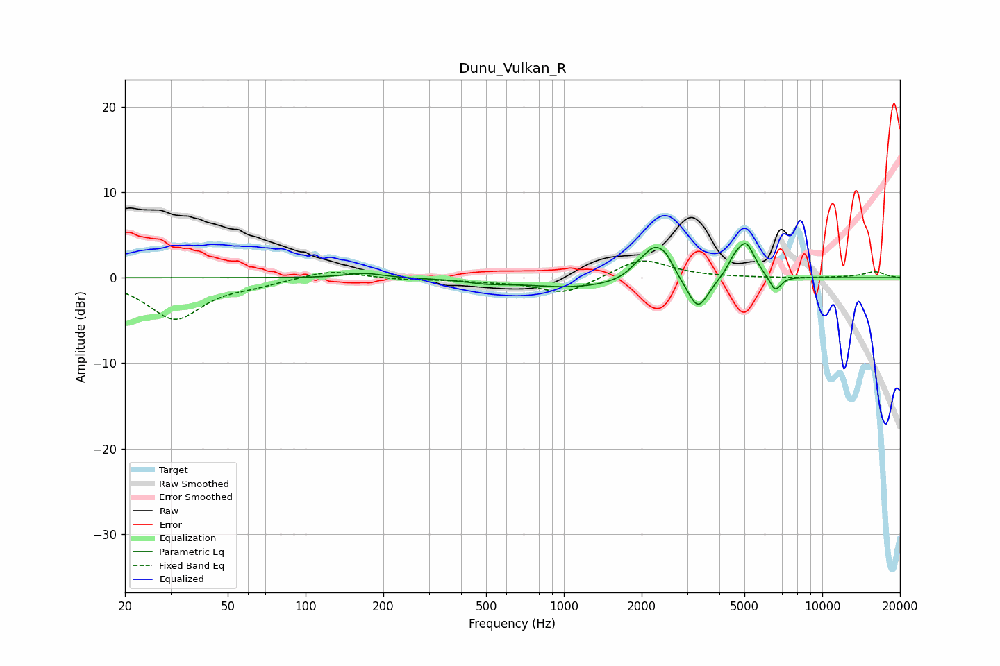

# Dunu_Vulkan_R
See [usage instructions](https://github.com/jaakkopasanen/AutoEq#usage) for more options and info.

### Parametric EQs
Apply preamp of -4.1 dB when using parametric equalizer.

|   # | Type    |   Fc (Hz) |    Q |   Gain (dB) |
|-----|---------|-----------|------|-------------|
|   1 | Peaking |       168 | 2.01 |         0.6 |
|   2 | Peaking |       501 | 2    |        -0.4 |
|   3 | Peaking |      1117 | 0.69 |        -1.2 |
|   4 | Peaking |      1911 | 4.5  |         0.5 |
|   5 | Peaking |      2254 | 2.75 |         4   |
|   6 | Peaking |      2503 | 5.81 |         0.8 |
|   7 | Peaking |      3303 | 3.46 |        -4   |
|   8 | Peaking |      4554 | 5.49 |         1.2 |
|   9 | Peaking |      5065 | 3.99 |         4   |
|  10 | Peaking |      6576 | 6    |        -1.9 |

### Fixed Band EQs
When using fixed band (also called graphic) equalizer, apply preamp of **-2.0 dB** (if available) and set gains manually with these parameters.

|   # | Type    |   Fc (Hz) |    Q |   Gain (dB) |
|-----|---------|-----------|------|-------------|
|   1 | Peaking |        31 | 1.41 |        -4.8 |
|   2 | Peaking |        62 | 1.41 |        -0.6 |
|   3 | Peaking |       125 | 1.41 |         0.9 |
|   4 | Peaking |       250 | 1.41 |        -0.2 |
|   5 | Peaking |       500 | 1.41 |        -0.3 |
|   6 | Peaking |      1000 | 1.41 |        -1.9 |
|   7 | Peaking |      2000 | 1.41 |         2.3 |
|   8 | Peaking |      4000 | 1.41 |         0   |
|   9 | Peaking |      8000 | 1.41 |        -0.1 |
|  10 | Peaking |     16000 | 1.41 |         0.7 |

### Graphs

