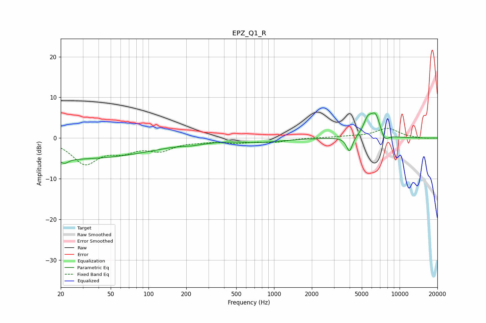

# EPZ_Q1_R
See [usage instructions](https://github.com/jaakkopasanen/AutoEq#usage) for more options and info.

### Parametric EQs
Apply preamp of -6.3 dB when using parametric equalizer.

|   # | Type    |   Fc (Hz) |    Q |   Gain (dB) |
|-----|---------|-----------|------|-------------|
|   1 | Peaking |        21 | 4.82 |        -1.1 |
|   2 | Peaking |        23 | 0.18 |        -5.1 |
|   3 | Peaking |       242 | 2.01 |        -1.1 |
|   4 | Peaking |       247 | 2.68 |         0.6 |
|   5 | Peaking |       767 | 0.78 |        -0.9 |
|   6 | Peaking |      3989 | 5.9  |        -3.8 |
|   7 | Peaking |      5535 | 4.71 |         2   |
|   8 | Peaking |      5630 | 3.32 |         1.4 |
|   9 | Peaking |      6433 | 3.24 |         5.4 |
|  10 | Peaking |      7563 | 4.22 |        -2.3 |

### Fixed Band EQs
When using fixed band (also called graphic) equalizer, apply preamp of **-2.5 dB** (if available) and set gains manually with these parameters.

|   # | Type    |   Fc (Hz) |    Q |   Gain (dB) |
|-----|---------|-----------|------|-------------|
|   1 | Peaking |        31 | 1.41 |        -6   |
|   2 | Peaking |        62 | 1.41 |        -2.6 |
|   3 | Peaking |       125 | 1.41 |        -2.6 |
|   4 | Peaking |       250 | 1.41 |        -0.5 |
|   5 | Peaking |       500 | 1.41 |        -1   |
|   6 | Peaking |      1000 | 1.41 |        -0.9 |
|   7 | Peaking |      2000 | 1.41 |         0.1 |
|   8 | Peaking |      4000 | 1.41 |         0.3 |
|   9 | Peaking |      8000 | 1.41 |         2.4 |
|  10 | Peaking |     16000 | 1.41 |        -0.1 |

### Graphs

