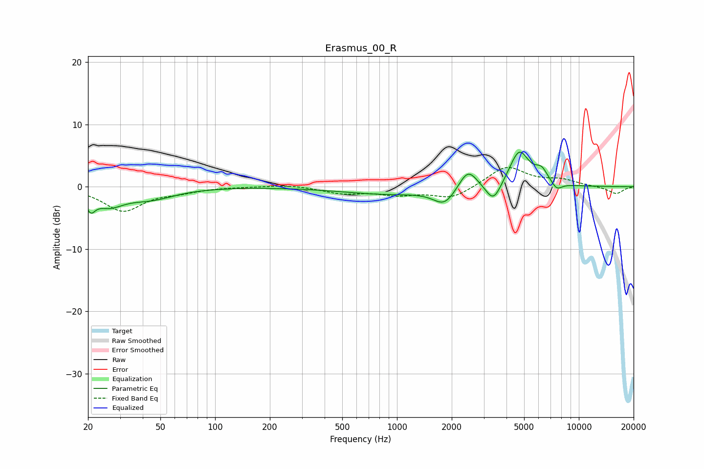

# Erasmus_00_R
See [usage instructions](https://github.com/jaakkopasanen/AutoEq#usage) for more options and info.

### Parametric EQs
Apply preamp of -5.6 dB when using parametric equalizer.

|   # | Type    |   Fc (Hz) |    Q |   Gain (dB) |
|-----|---------|-----------|------|-------------|
|   1 | Peaking |        21 | 5.72 |        -2.3 |
|   2 | Peaking |        26 | 1.73 |        -2.5 |
|   3 | Peaking |        44 | 1.06 |        -1.7 |
|   4 | Peaking |       884 | 0.55 |        -1.1 |
|   5 | Peaking |      1828 | 2.32 |        -2.6 |
|   6 | Peaking |      2455 | 2.78 |         3.4 |
|   7 | Peaking |      3392 | 3.36 |        -3.2 |
|   8 | Peaking |      4699 | 2.56 |         5.8 |
|   9 | Peaking |      6229 | 3.78 |         2   |
|  10 | Peaking |      7559 | 4.61 |        -1.2 |

### Fixed Band EQs
When using fixed band (also called graphic) equalizer, apply preamp of **-3.2 dB** (if available) and set gains manually with these parameters.

|   # | Type    |   Fc (Hz) |    Q |   Gain (dB) |
|-----|---------|-----------|------|-------------|
|   1 | Peaking |        31 | 1.41 |        -3.8 |
|   2 | Peaking |        62 | 1.41 |        -0.7 |
|   3 | Peaking |       125 | 1.41 |         0   |
|   4 | Peaking |       250 | 1.41 |         0.4 |
|   5 | Peaking |       500 | 1.41 |        -1   |
|   6 | Peaking |      1000 | 1.41 |        -1.1 |
|   7 | Peaking |      2000 | 1.41 |        -1.9 |
|   8 | Peaking |      4000 | 1.41 |         3.3 |
|   9 | Peaking |      8000 | 1.41 |         1   |
|  10 | Peaking |     16000 | 1.41 |        -1.2 |

### Graphs

