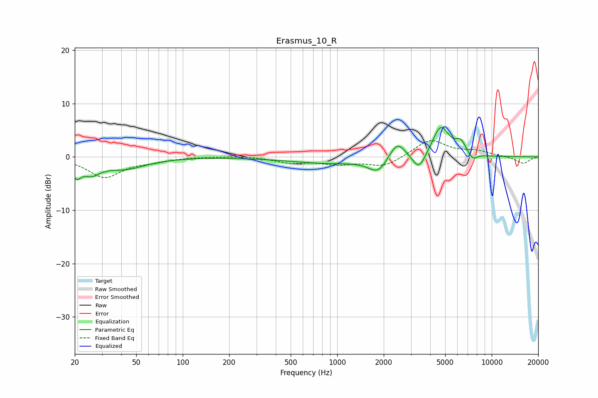

# Erasmus_10_R
See [usage instructions](https://github.com/jaakkopasanen/AutoEq#usage) for more options and info.

### Parametric EQs
Apply preamp of -5.6 dB when using parametric equalizer.

|   # | Type    |   Fc (Hz) |    Q |   Gain (dB) |
|-----|---------|-----------|------|-------------|
|   1 | Peaking |        20 | 4.78 |        -2.6 |
|   2 | Peaking |        26 | 2.47 |        -2.3 |
|   3 | Peaking |        42 | 1.03 |        -2.1 |
|   4 | Peaking |       877 | 0.55 |        -1.2 |
|   5 | Peaking |      1841 | 2.28 |        -2.7 |
|   6 | Peaking |      2445 | 2.69 |         3.5 |
|   7 | Peaking |      3385 | 3.3  |        -3.2 |
|   8 | Peaking |      4677 | 2.56 |         5.8 |
|   9 | Peaking |      6296 | 3.94 |         2.3 |
|  10 | Peaking |      7527 | 4.54 |        -1.3 |

### Fixed Band EQs
When using fixed band (also called graphic) equalizer, apply preamp of **-3.1 dB** (if available) and set gains manually with these parameters.

|   # | Type    |   Fc (Hz) |    Q |   Gain (dB) |
|-----|---------|-----------|------|-------------|
|   1 | Peaking |        31 | 1.41 |        -3.8 |
|   2 | Peaking |        62 | 1.41 |        -0.7 |
|   3 | Peaking |       125 | 1.41 |         0.1 |
|   4 | Peaking |       250 | 1.41 |         0.2 |
|   5 | Peaking |       500 | 1.41 |        -1   |
|   6 | Peaking |      1000 | 1.41 |        -1.2 |
|   7 | Peaking |      2000 | 1.41 |        -1.8 |
|   8 | Peaking |      4000 | 1.41 |         3.3 |
|   9 | Peaking |      8000 | 1.41 |         1   |
|  10 | Peaking |     16000 | 1.41 |        -1.3 |

### Graphs

