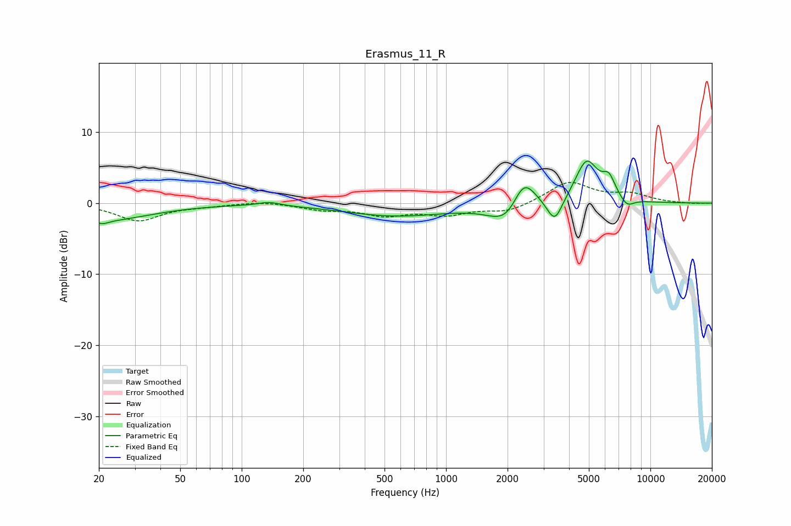

# Erasmus_11_R
See [usage instructions](https://github.com/jaakkopasanen/AutoEq#usage) for more options and info.

### Parametric EQs
Apply preamp of -6.0 dB when using parametric equalizer.

|   # | Type    |   Fc (Hz) |    Q |   Gain (dB) |
|-----|---------|-----------|------|-------------|
|   1 | Peaking |        20 | 0.6  |        -2.5 |
|   2 | Peaking |        21 | 5.28 |        -0.4 |
|   3 | Peaking |       136 | 2.59 |         0.5 |
|   4 | Peaking |       570 | 0.55 |        -1.8 |
|   5 | Peaking |      2026 | 1.64 |        -3.6 |
|   6 | Peaking |      2394 | 2.39 |         5.2 |
|   7 | Peaking |      3403 | 3.73 |        -3.5 |
|   8 | Peaking |      4875 | 2.47 |         6   |
|   9 | Peaking |      6262 | 4.24 |         2.6 |
|  10 | Peaking |      7680 | 4.04 |        -1.2 |

### Fixed Band EQs
When using fixed band (also called graphic) equalizer, apply preamp of **-3.0 dB** (if available) and set gains manually with these parameters.

|   # | Type    |   Fc (Hz) |    Q |   Gain (dB) |
|-----|---------|-----------|------|-------------|
|   1 | Peaking |        31 | 1.41 |        -2.4 |
|   2 | Peaking |        62 | 1.41 |        -0.3 |
|   3 | Peaking |       125 | 1.41 |         0.3 |
|   4 | Peaking |       250 | 1.41 |        -0.8 |
|   5 | Peaking |       500 | 1.41 |        -1.5 |
|   6 | Peaking |      1000 | 1.41 |        -1.4 |
|   7 | Peaking |      2000 | 1.41 |        -1.2 |
|   8 | Peaking |      4000 | 1.41 |         3   |
|   9 | Peaking |      8000 | 1.41 |         1.1 |
|  10 | Peaking |     16000 | 1.41 |        -0.1 |

### Graphs

