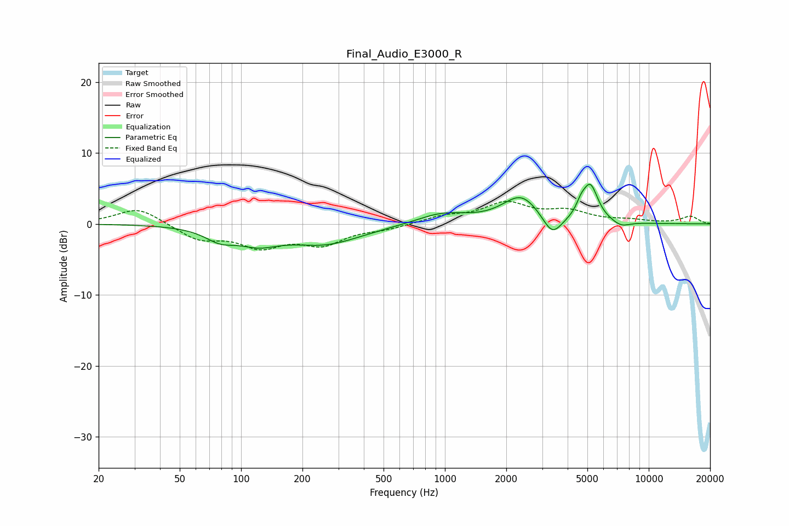

# Final_Audio_E3000_R
See [usage instructions](https://github.com/jaakkopasanen/AutoEq#usage) for more options and info.

### Parametric EQs
Apply preamp of -5.7 dB when using parametric equalizer.

|   # | Type    |   Fc (Hz) |    Q |   Gain (dB) |
|-----|---------|-----------|------|-------------|
|   1 | Peaking |        80 | 1.88 |        -3.1 |
|   2 | Peaking |        81 | 1.92 |         1.5 |
|   3 | Peaking |       121 | 1.42 |        -1.9 |
|   4 | Peaking |       257 | 0.77 |        -2.7 |
|   5 | Peaking |       972 | 1.14 |         1.5 |
|   6 | Peaking |      2368 | 1.57 |         3.9 |
|   7 | Peaking |      3361 | 2.97 |        -3   |
|   8 | Peaking |      4651 | 6    |         1.3 |
|   9 | Peaking |      5167 | 3.66 |         5.1 |
|  10 | Peaking |      7307 | 3.16 |        -0.8 |

### Fixed Band EQs
When using fixed band (also called graphic) equalizer, apply preamp of **-3.3 dB** (if available) and set gains manually with these parameters.

|   # | Type    |   Fc (Hz) |    Q |   Gain (dB) |
|-----|---------|-----------|------|-------------|
|   1 | Peaking |        31 | 1.41 |         2.4 |
|   2 | Peaking |        62 | 1.41 |        -2.1 |
|   3 | Peaking |       125 | 1.41 |        -2.9 |
|   4 | Peaking |       250 | 1.41 |        -2.6 |
|   5 | Peaking |       500 | 1.41 |        -0.6 |
|   6 | Peaking |      1000 | 1.41 |         1   |
|   7 | Peaking |      2000 | 1.41 |         2.8 |
|   8 | Peaking |      4000 | 1.41 |         1.6 |
|   9 | Peaking |      8000 | 1.41 |         0.4 |
|  10 | Peaking |     16000 | 1.41 |         1   |

### Graphs

