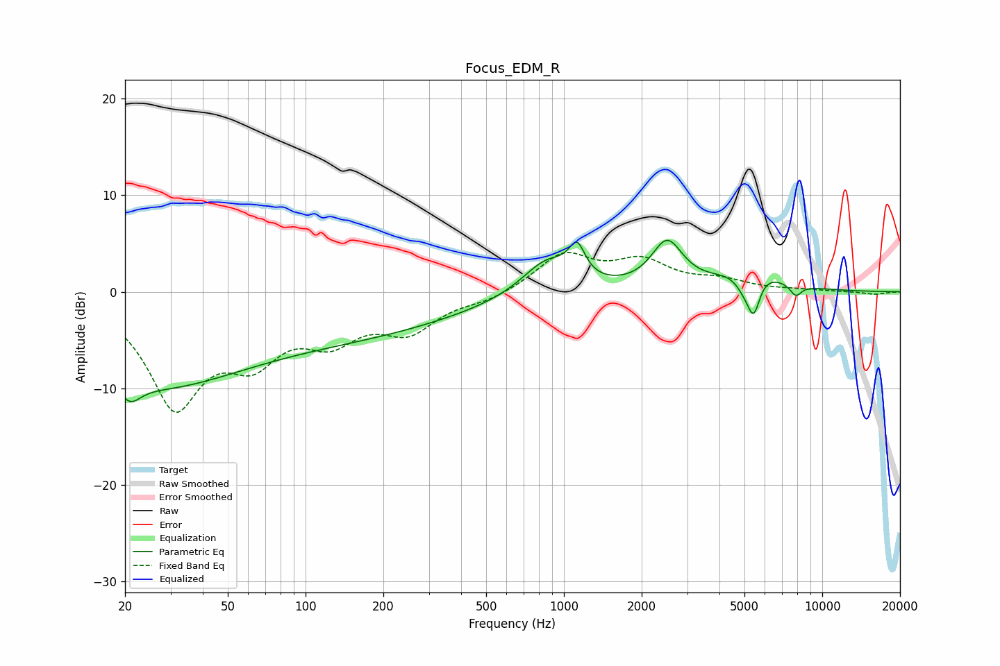

# Focus_EDM_R
See [usage instructions](https://github.com/jaakkopasanen/AutoEq#usage) for more options and info.

### Parametric EQs
Apply preamp of -5.4 dB when using parametric equalizer.

|   # | Type    |   Fc (Hz) |    Q |   Gain (dB) |
|-----|---------|-----------|------|-------------|
|   1 | Peaking |        21 | 3.33 |        -2.2 |
|   2 | Peaking |        24 | 0.46 |        -5.8 |
|   3 | Peaking |        78 | 0.19 |        -5.1 |
|   4 | Peaking |       862 | 1.45 |         3.7 |
|   5 | Peaking |      1125 | 4.6  |         3.1 |
|   6 | Peaking |      2510 | 2.34 |         4.8 |
|   7 | Peaking |      5050 | 3.34 |        -2.3 |
|   8 | Peaking |      5232 | 1.34 |         2.8 |
|   9 | Peaking |      5434 | 5.84 |        -3.6 |
|  10 | Peaking |      7900 | 5.95 |        -1.2 |

### Fixed Band EQs
When using fixed band (also called graphic) equalizer, apply preamp of **-4.2 dB** (if available) and set gains manually with these parameters.

|   # | Type    |   Fc (Hz) |    Q |   Gain (dB) |
|-----|---------|-----------|------|-------------|
|   1 | Peaking |        31 | 1.41 |       -11.3 |
|   2 | Peaking |        62 | 1.41 |        -5.4 |
|   3 | Peaking |       125 | 1.41 |        -4   |
|   4 | Peaking |       250 | 1.41 |        -3.6 |
|   5 | Peaking |       500 | 1.41 |        -0.8 |
|   6 | Peaking |      1000 | 1.41 |         3.8 |
|   7 | Peaking |      2000 | 1.41 |         2.8 |
|   8 | Peaking |      4000 | 1.41 |         1   |
|   9 | Peaking |      8000 | 1.41 |         0.1 |
|  10 | Peaking |     16000 | 1.41 |        -0.3 |

### Graphs

