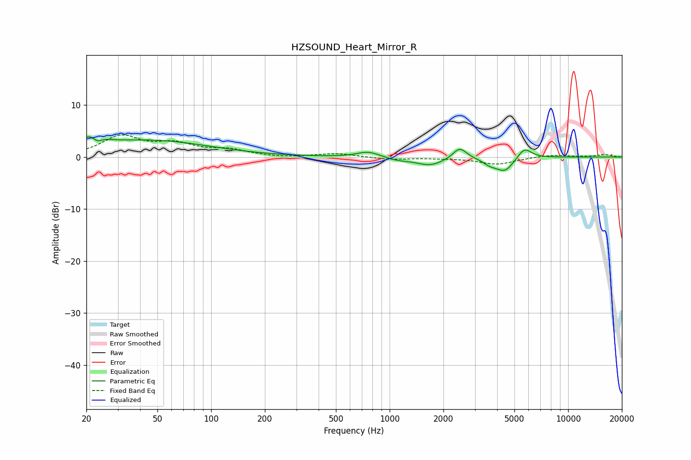

# HZSOUND_Heart_Mirror_R
See [usage instructions](https://github.com/jaakkopasanen/AutoEq#usage) for more options and info.

### Parametric EQs
Apply preamp of -4.0 dB when using parametric equalizer.

|   # | Type    |   Fc (Hz) |    Q |   Gain (dB) |
|-----|---------|-----------|------|-------------|
|   1 | Peaking |        22 | 2.58 |         3   |
|   2 | Peaking |        23 | 4.78 |        -1.9 |
|   3 | Peaking |        45 | 0.42 |         3.1 |
|   4 | Peaking |       758 | 2.33 |         1.1 |
|   5 | Peaking |      1120 | 2.17 |        -0.5 |
|   6 | Peaking |      1686 | 1.86 |        -1.6 |
|   7 | Peaking |      2470 | 3.74 |         2.2 |
|   8 | Peaking |      3639 | 3.71 |        -0.9 |
|   9 | Peaking |      4419 | 2.82 |        -2.7 |
|  10 | Peaking |      5683 | 3.49 |         2.1 |

### Fixed Band EQs
When using fixed band (also called graphic) equalizer, apply preamp of **-4.4 dB** (if available) and set gains manually with these parameters.

|   # | Type    |   Fc (Hz) |    Q |   Gain (dB) |
|-----|---------|-----------|------|-------------|
|   1 | Peaking |        31 | 1.41 |         3.8 |
|   2 | Peaking |        62 | 1.41 |         2.2 |
|   3 | Peaking |       125 | 1.41 |         1.2 |
|   4 | Peaking |       250 | 1.41 |        -0.2 |
|   5 | Peaking |       500 | 1.41 |         0.7 |
|   6 | Peaking |      1000 | 1.41 |        -0.5 |
|   7 | Peaking |      2000 | 1.41 |        -0.1 |
|   8 | Peaking |      4000 | 1.41 |        -1.4 |
|   9 | Peaking |      8000 | 1.41 |         0.4 |
|  10 | Peaking |     16000 | 1.41 |         0.5 |

### Graphs

