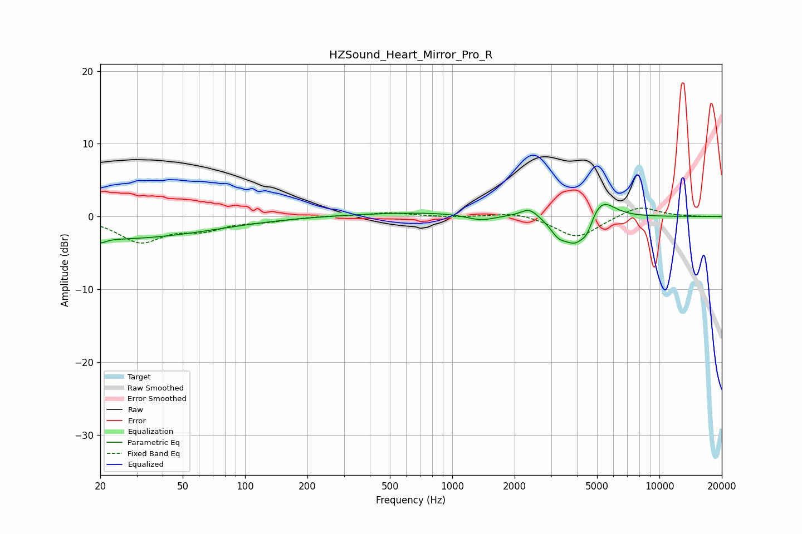

# HZSound_Heart_Mirror_Pro_R
See [usage instructions](https://github.com/jaakkopasanen/AutoEq#usage) for more options and info.

### Parametric EQs
Apply preamp of -1.8 dB when using parametric equalizer.

|   # | Type    |   Fc (Hz) |    Q |   Gain (dB) |
|-----|---------|-----------|------|-------------|
|   1 | Peaking |        20 | 5.47 |        -0.6 |
|   2 | Peaking |        24 | 0.3  |        -3   |
|   3 | Peaking |       787 | 0.38 |         0.6 |
|   4 | Peaking |      1373 | 1.93 |        -0.9 |
|   5 | Peaking |      2354 | 3.52 |         1.1 |
|   6 | Peaking |      2408 | 2.45 |         0.2 |
|   7 | Peaking |      3244 | 3.59 |        -1.7 |
|   8 | Peaking |      3955 | 2.28 |        -4   |
|   9 | Peaking |      4479 | 5.78 |        -1.3 |
|  10 | Peaking |      5221 | 2.21 |         3.1 |

### Fixed Band EQs
When using fixed band (also called graphic) equalizer, apply preamp of **-1.3 dB** (if available) and set gains manually with these parameters.

|   # | Type    |   Fc (Hz) |    Q |   Gain (dB) |
|-----|---------|-----------|------|-------------|
|   1 | Peaking |        31 | 1.41 |        -3.3 |
|   2 | Peaking |        62 | 1.41 |        -1.5 |
|   3 | Peaking |       125 | 1.41 |        -0.5 |
|   4 | Peaking |       250 | 1.41 |         0.1 |
|   5 | Peaking |       500 | 1.41 |         0.5 |
|   6 | Peaking |      1000 | 1.41 |        -0.1 |
|   7 | Peaking |      2000 | 1.41 |         0.7 |
|   8 | Peaking |      4000 | 1.41 |        -3   |
|   9 | Peaking |      8000 | 1.41 |         1.5 |
|  10 | Peaking |     16000 | 1.41 |        -0   |

### Graphs

