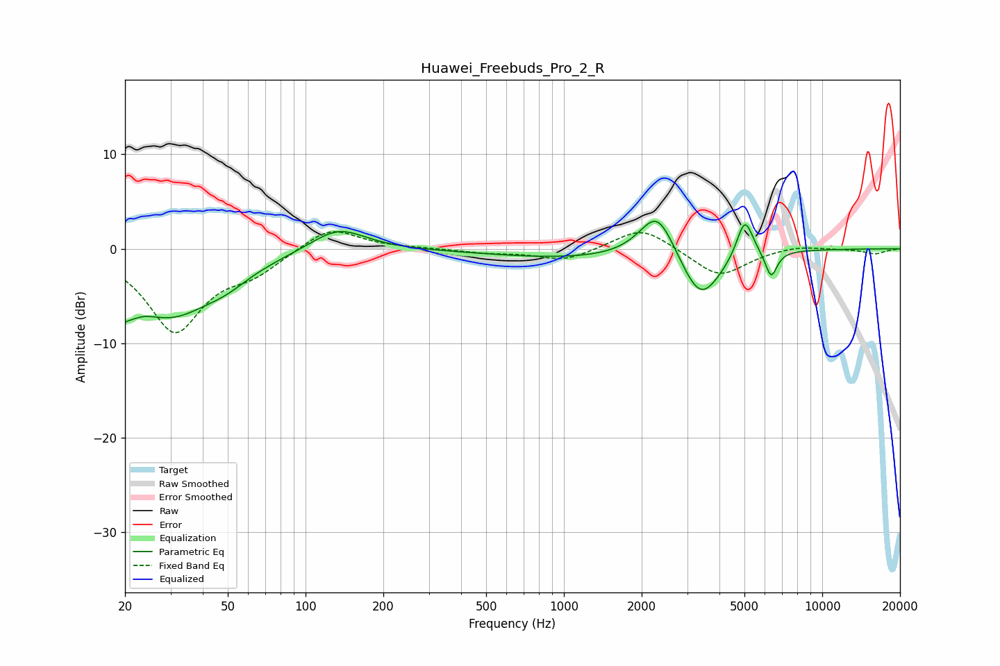

# Huawei_Freebuds_Pro_2_R
See [usage instructions](https://github.com/jaakkopasanen/AutoEq#usage) for more options and info.

### Parametric EQs
Apply preamp of -3.0 dB when using parametric equalizer.

|   # | Type    |   Fc (Hz) |    Q |   Gain (dB) |
|-----|---------|-----------|------|-------------|
|   1 | Peaking |        20 | 4.47 |        -6   |
|   2 | Peaking |        20 | 5.78 |         3.2 |
|   3 | Peaking |        30 | 0.78 |        -6.8 |
|   4 | Peaking |        50 | 1.66 |        -1   |
|   5 | Peaking |       134 | 1.32 |         2.5 |
|   6 | Peaking |      1060 | 0.45 |        -1   |
|   7 | Peaking |      2300 | 2.04 |         5.2 |
|   8 | Peaking |      3382 | 1.8  |        -5.6 |
|   9 | Peaking |      5015 | 4.38 |         4.3 |
|  10 | Peaking |      6344 | 6    |        -2.8 |

### Fixed Band EQs
When using fixed band (also called graphic) equalizer, apply preamp of **-1.9 dB** (if available) and set gains manually with these parameters.

|   # | Type    |   Fc (Hz) |    Q |   Gain (dB) |
|-----|---------|-----------|------|-------------|
|   1 | Peaking |        31 | 1.41 |        -8.6 |
|   2 | Peaking |        62 | 1.41 |        -2   |
|   3 | Peaking |       125 | 1.41 |         2.5 |
|   4 | Peaking |       250 | 1.41 |         0.1 |
|   5 | Peaking |       500 | 1.41 |        -0.4 |
|   6 | Peaking |      1000 | 1.41 |        -1.3 |
|   7 | Peaking |      2000 | 1.41 |         2.4 |
|   8 | Peaking |      4000 | 1.41 |        -3   |
|   9 | Peaking |      8000 | 1.41 |         0.4 |
|  10 | Peaking |     16000 | 1.41 |        -0.5 |

### Graphs

