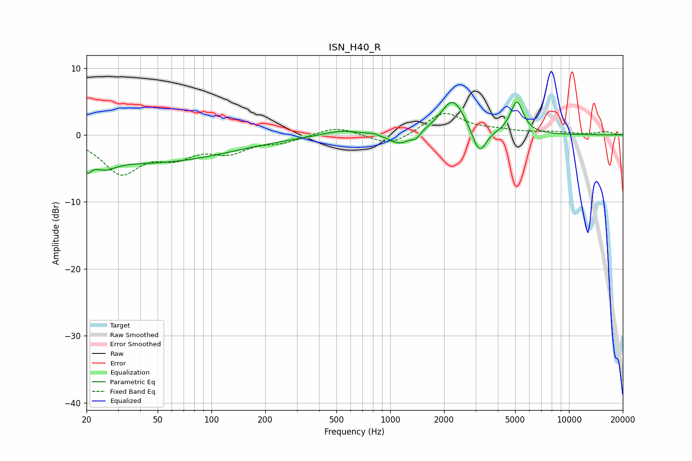

# ISN_H40_R
See [usage instructions](https://github.com/jaakkopasanen/AutoEq#usage) for more options and info.

### Parametric EQs
Apply preamp of -5.0 dB when using parametric equalizer.

|   # | Type    |   Fc (Hz) |    Q |   Gain (dB) |
|-----|---------|-----------|------|-------------|
|   1 | Peaking |        20 | 5.86 |        -2   |
|   2 | Peaking |        25 | 2.34 |        -1.5 |
|   3 | Peaking |        45 | 0.3  |        -4.1 |
|   4 | Peaking |       536 | 1.34 |         0.8 |
|   5 | Peaking |       798 | 5.97 |         0.2 |
|   6 | Peaking |      1130 | 2.47 |        -1.7 |
|   7 | Peaking |      1392 | 5.96 |        -0.8 |
|   8 | Peaking |      2240 | 2.04 |         5.4 |
|   9 | Peaking |      3150 | 3.68 |        -4   |
|  10 | Peaking |      5112 | 3.95 |         4.8 |

### Fixed Band EQs
When using fixed band (also called graphic) equalizer, apply preamp of **-3.3 dB** (if available) and set gains manually with these parameters.

|   # | Type    |   Fc (Hz) |    Q |   Gain (dB) |
|-----|---------|-----------|------|-------------|
|   1 | Peaking |        31 | 1.41 |        -5.4 |
|   2 | Peaking |        62 | 1.41 |        -2.6 |
|   3 | Peaking |       125 | 1.41 |        -2.2 |
|   4 | Peaking |       250 | 1.41 |        -0.9 |
|   5 | Peaking |       500 | 1.41 |         1.3 |
|   6 | Peaking |      1000 | 1.41 |        -1.8 |
|   7 | Peaking |      2000 | 1.41 |         3.4 |
|   8 | Peaking |      4000 | 1.41 |         0.5 |
|   9 | Peaking |      8000 | 1.41 |         0.4 |
|  10 | Peaking |     16000 | 1.41 |         0.5 |

### Graphs

