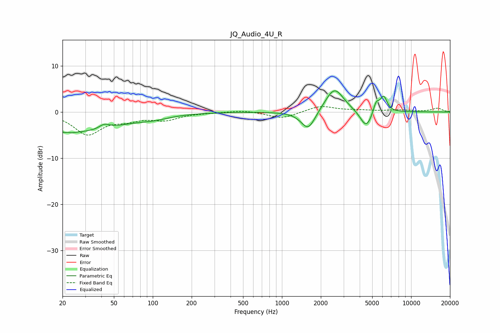

# JQ_Audio_4U_R
See [usage instructions](https://github.com/jaakkopasanen/AutoEq#usage) for more options and info.

### Parametric EQs
Apply preamp of -4.7 dB when using parametric equalizer.

|   # | Type    |   Fc (Hz) |    Q |   Gain (dB) |
|-----|---------|-----------|------|-------------|
|   1 | Peaking |        22 | 5.05 |        -3.7 |
|   2 | Peaking |        22 | 5.81 |         3.3 |
|   3 | Peaking |        27 | 0.44 |        -4.2 |
|   4 | Peaking |        42 | 3.54 |         1   |
|   5 | Peaking |       103 | 1.23 |        -0.7 |
|   6 | Peaking |      1597 | 2.53 |        -4.3 |
|   7 | Peaking |      2548 | 1.95 |         5.4 |
|   8 | Peaking |      4493 | 3.03 |        -3.9 |
|   9 | Peaking |      5366 | 5.95 |         2.4 |
|  10 | Peaking |      6132 | 5.19 |         3.3 |

### Fixed Band EQs
When using fixed band (also called graphic) equalizer, apply preamp of **-1.3 dB** (if available) and set gains manually with these parameters.

|   # | Type    |   Fc (Hz) |    Q |   Gain (dB) |
|-----|---------|-----------|------|-------------|
|   1 | Peaking |        31 | 1.41 |        -4.7 |
|   2 | Peaking |        62 | 1.41 |        -1.3 |
|   3 | Peaking |       125 | 1.41 |        -1.5 |
|   4 | Peaking |       250 | 1.41 |        -0.1 |
|   5 | Peaking |       500 | 1.41 |         0.4 |
|   6 | Peaking |      1000 | 1.41 |        -1.5 |
|   7 | Peaking |      2000 | 1.41 |         1.3 |
|   8 | Peaking |      4000 | 1.41 |         0.3 |
|   9 | Peaking |      8000 | 1.41 |         0.4 |
|  10 | Peaking |     16000 | 1.41 |         0.8 |

### Graphs

