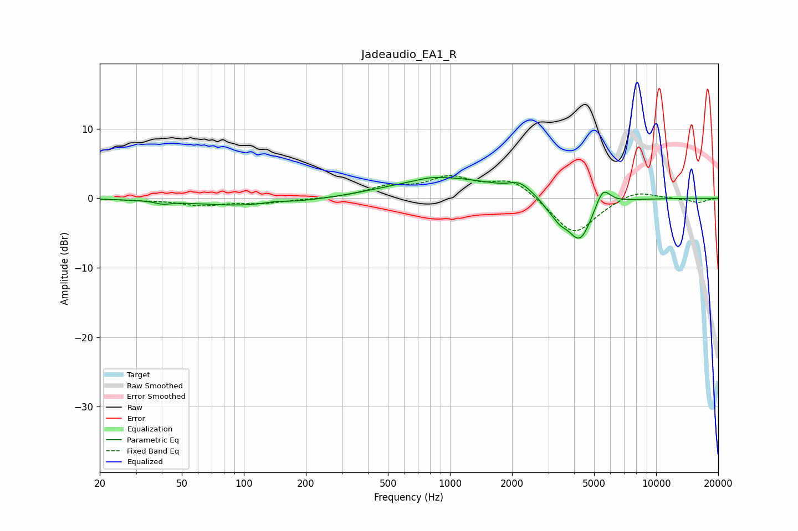

# Jadeaudio_EA1_R
See [usage instructions](https://github.com/jaakkopasanen/AutoEq#usage) for more options and info.

### Parametric EQs
Apply preamp of -3.1 dB when using parametric equalizer.

|   # | Type    |   Fc (Hz) |    Q |   Gain (dB) |
|-----|---------|-----------|------|-------------|
|   1 | Peaking |        41 | 4.07 |        -0.4 |
|   2 | Peaking |       108 | 0.52 |        -1.1 |
|   3 | Peaking |       143 | 2.37 |         0.4 |
|   4 | Peaking |       815 | 2.86 |         0.2 |
|   5 | Peaking |       961 | 0.53 |         2.9 |
|   6 | Peaking |      2182 | 2.75 |         1.3 |
|   7 | Peaking |      2962 | 4.5  |        -0.6 |
|   8 | Peaking |      3396 | 3.76 |        -1.8 |
|   9 | Peaking |      4261 | 2.27 |        -6.3 |
|  10 | Peaking |      5508 | 3.8  |         3   |

### Fixed Band EQs
When using fixed band (also called graphic) equalizer, apply preamp of **-3.4 dB** (if available) and set gains manually with these parameters.

|   # | Type    |   Fc (Hz) |    Q |   Gain (dB) |
|-----|---------|-----------|------|-------------|
|   1 | Peaking |        31 | 1.41 |        -0.2 |
|   2 | Peaking |        62 | 1.41 |        -1   |
|   3 | Peaking |       125 | 1.41 |        -0.6 |
|   4 | Peaking |       250 | 1.41 |        -0.1 |
|   5 | Peaking |       500 | 1.41 |         1.4 |
|   6 | Peaking |      1000 | 1.41 |         2.7 |
|   7 | Peaking |      2000 | 1.41 |         2.7 |
|   8 | Peaking |      4000 | 1.41 |        -5.4 |
|   9 | Peaking |      8000 | 1.41 |         1.3 |
|  10 | Peaking |     16000 | 1.41 |        -0.6 |

### Graphs

