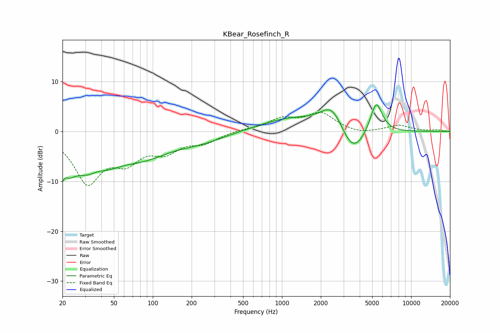

# KBear_Rosefinch_R
See [usage instructions](https://github.com/jaakkopasanen/AutoEq#usage) for more options and info.

### Parametric EQs
Apply preamp of -5.4 dB when using parametric equalizer.

|   # | Type    |   Fc (Hz) |    Q |   Gain (dB) |
|-----|---------|-----------|------|-------------|
|   1 | Peaking |        20 | 2.72 |        -8.3 |
|   2 | Peaking |        21 | 5.96 |         3.1 |
|   3 | Peaking |        34 | 0.86 |        -8.1 |
|   4 | Peaking |        37 | 2.03 |         1.9 |
|   5 | Peaking |        87 | 0.7  |        -3.6 |
|   6 | Peaking |       234 | 0.72 |        -1.7 |
|   7 | Peaking |      1174 | 0.58 |         2.6 |
|   8 | Peaking |      2458 | 1.56 |         5.3 |
|   9 | Peaking |      3519 | 1.4  |        -6.1 |
|  10 | Peaking |      5362 | 2.9  |         6.7 |

### Fixed Band EQs
When using fixed band (also called graphic) equalizer, apply preamp of **-3.9 dB** (if available) and set gains manually with these parameters.

|   # | Type    |   Fc (Hz) |    Q |   Gain (dB) |
|-----|---------|-----------|------|-------------|
|   1 | Peaking |        31 | 1.41 |        -9.8 |
|   2 | Peaking |        62 | 1.41 |        -4.8 |
|   3 | Peaking |       125 | 1.41 |        -3.4 |
|   4 | Peaking |       250 | 1.41 |        -1.9 |
|   5 | Peaking |       500 | 1.41 |         0.4 |
|   6 | Peaking |      1000 | 1.41 |         2.3 |
|   7 | Peaking |      2000 | 1.41 |         3.5 |
|   8 | Peaking |      4000 | 1.41 |        -0.6 |
|   9 | Peaking |      8000 | 1.41 |         1.2 |
|  10 | Peaking |     16000 | 1.41 |         0.3 |

### Graphs

