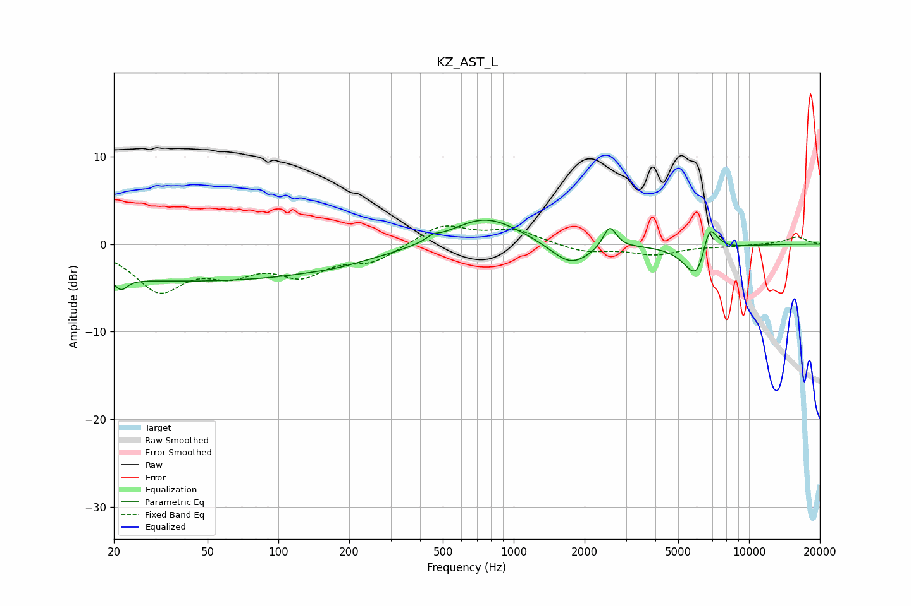

# KZ_AST_L
See [usage instructions](https://github.com/jaakkopasanen/AutoEq#usage) for more options and info.

### Parametric EQs
Apply preamp of -2.8 dB when using parametric equalizer.

|   # | Type    |   Fc (Hz) |    Q |   Gain (dB) |
|-----|---------|-----------|------|-------------|
|   1 | Peaking |        21 | 5.54 |        -1.3 |
|   2 | Peaking |        43 | 0.18 |        -4.2 |
|   3 | Peaking |       179 | 1.93 |        -0.1 |
|   4 | Peaking |       452 | 5.58 |         0.5 |
|   5 | Peaking |       753 | 0.94 |         3.3 |
|   6 | Peaking |      1748 | 1.67 |        -2.7 |
|   7 | Peaking |      2557 | 5.08 |         2.6 |
|   8 | Peaking |      6090 | 2.56 |        -5.1 |
|   9 | Peaking |      6753 | 4.05 |         4.8 |
|  10 | Peaking |      7604 | 4.53 |         0.2 |

### Fixed Band EQs
When using fixed band (also called graphic) equalizer, apply preamp of **-2.2 dB** (if available) and set gains manually with these parameters.

|   # | Type    |   Fc (Hz) |    Q |   Gain (dB) |
|-----|---------|-----------|------|-------------|
|   1 | Peaking |        31 | 1.41 |        -5   |
|   2 | Peaking |        62 | 1.41 |        -2.6 |
|   3 | Peaking |       125 | 1.41 |        -3.1 |
|   4 | Peaking |       250 | 1.41 |        -1.8 |
|   5 | Peaking |       500 | 1.41 |         2.2 |
|   6 | Peaking |      1000 | 1.41 |         1.5 |
|   7 | Peaking |      2000 | 1.41 |        -0.9 |
|   8 | Peaking |      4000 | 1.41 |        -1.1 |
|   9 | Peaking |      8000 | 1.41 |        -0.2 |
|  10 | Peaking |     16000 | 1.41 |         0.8 |

### Graphs

