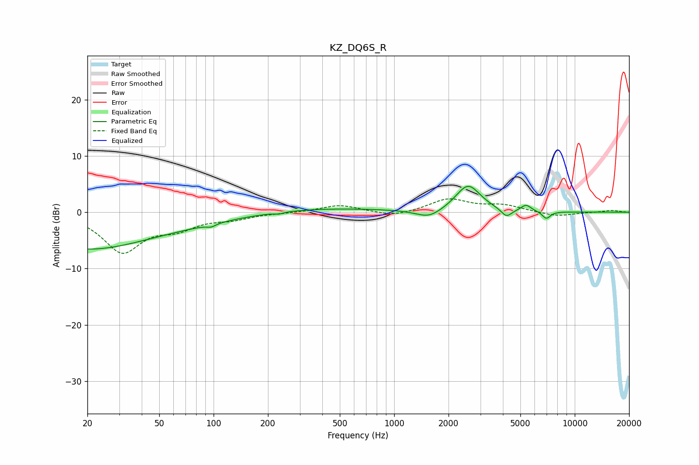

# KZ_DQ6S_R
See [usage instructions](https://github.com/jaakkopasanen/AutoEq#usage) for more options and info.

### Parametric EQs
Apply preamp of -4.7 dB when using parametric equalizer.

|   # | Type    |   Fc (Hz) |    Q |   Gain (dB) |
|-----|---------|-----------|------|-------------|
|   1 | Peaking |        20 | 0.47 |        -3.9 |
|   2 | Peaking |        24 | 0.18 |        -2.7 |
|   3 | Peaking |        97 | 5.84 |        -0.5 |
|   4 | Peaking |       230 | 5.98 |        -0.3 |
|   5 | Peaking |       329 | 0.34 |         0.8 |
|   6 | Peaking |      1557 | 2    |        -1.5 |
|   7 | Peaking |      2566 | 2.07 |         4.8 |
|   8 | Peaking |      4185 | 4.76 |        -1.5 |
|   9 | Peaking |      5378 | 4.97 |         1.1 |
|  10 | Peaking |      6957 | 5.98 |        -1.3 |

### Fixed Band EQs
When using fixed band (also called graphic) equalizer, apply preamp of **-2.5 dB** (if available) and set gains manually with these parameters.

|   # | Type    |   Fc (Hz) |    Q |   Gain (dB) |
|-----|---------|-----------|------|-------------|
|   1 | Peaking |        31 | 1.41 |        -6.8 |
|   2 | Peaking |        62 | 1.41 |        -2.3 |
|   3 | Peaking |       125 | 1.41 |        -1   |
|   4 | Peaking |       250 | 1.41 |        -0.1 |
|   5 | Peaking |       500 | 1.41 |         1.3 |
|   6 | Peaking |      1000 | 1.41 |        -0.9 |
|   7 | Peaking |      2000 | 1.41 |         2.3 |
|   8 | Peaking |      4000 | 1.41 |         1.1 |
|   9 | Peaking |      8000 | 1.41 |        -0.8 |
|  10 | Peaking |     16000 | 1.41 |         0.3 |

### Graphs

