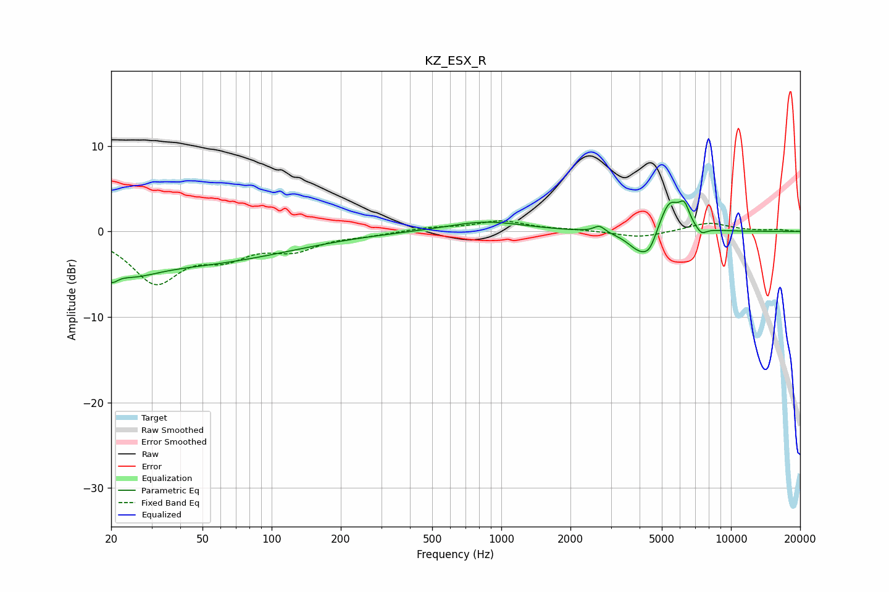

# KZ_ESX_R
See [usage instructions](https://github.com/jaakkopasanen/AutoEq#usage) for more options and info.

### Parametric EQs
Apply preamp of -3.7 dB when using parametric equalizer.

|   # | Type    |   Fc (Hz) |    Q |   Gain (dB) |
|-----|---------|-----------|------|-------------|
|   1 | Peaking |        20 | 5.1  |        -1.5 |
|   2 | Peaking |        25 | 1.37 |        -1.5 |
|   3 | Peaking |        37 | 0.28 |        -3.8 |
|   4 | Peaking |       852 | 0.87 |         1.2 |
|   5 | Peaking |      2672 | 5.96 |         0.8 |
|   6 | Peaking |      4061 | 2.47 |        -2.7 |
|   7 | Peaking |      4439 | 4.99 |        -1.2 |
|   8 | Peaking |      5388 | 3.12 |         3.8 |
|   9 | Peaking |      6266 | 5.88 |         2.2 |
|  10 | Peaking |      7432 | 5.88 |        -0.8 |

### Fixed Band EQs
When using fixed band (also called graphic) equalizer, apply preamp of **-1.3 dB** (if available) and set gains manually with these parameters.

|   # | Type    |   Fc (Hz) |    Q |   Gain (dB) |
|-----|---------|-----------|------|-------------|
|   1 | Peaking |        31 | 1.41 |        -5.7 |
|   2 | Peaking |        62 | 1.41 |        -2.4 |
|   3 | Peaking |       125 | 1.41 |        -1.9 |
|   4 | Peaking |       250 | 1.41 |        -0.3 |
|   5 | Peaking |       500 | 1.41 |         0.4 |
|   6 | Peaking |      1000 | 1.41 |         1.2 |
|   7 | Peaking |      2000 | 1.41 |         0.2 |
|   8 | Peaking |      4000 | 1.41 |        -0.8 |
|   9 | Peaking |      8000 | 1.41 |         1   |
|  10 | Peaking |     16000 | 1.41 |         0.2 |

### Graphs

