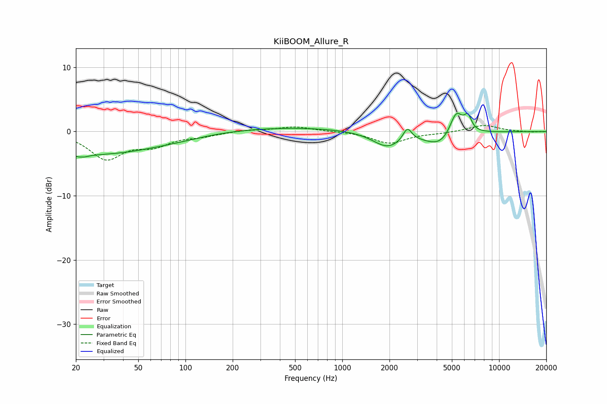

# KiiBOOM_Allure_R
See [usage instructions](https://github.com/jaakkopasanen/AutoEq#usage) for more options and info.

### Parametric EQs
Apply preamp of -2.9 dB when using parametric equalizer.

|   # | Type    |   Fc (Hz) |    Q |   Gain (dB) |
|-----|---------|-----------|------|-------------|
|   1 | Peaking |        22 | 5.6  |        -3.6 |
|   2 | Peaking |        22 | 6    |         3.2 |
|   3 | Peaking |        25 | 0.3  |        -3.6 |
|   4 | Peaking |        95 | 1.14 |        -0.1 |
|   5 | Peaking |       428 | 0.33 |         0.7 |
|   6 | Peaking |      1941 | 1.52 |        -2.4 |
|   7 | Peaking |      2600 | 5.15 |         2   |
|   8 | Peaking |      4244 | 1.46 |        -2.3 |
|   9 | Peaking |      5328 | 3.25 |         4   |
|  10 | Peaking |      6325 | 5.95 |         2.1 |

### Fixed Band EQs
When using fixed band (also called graphic) equalizer, apply preamp of **-1.0 dB** (if available) and set gains manually with these parameters.

|   # | Type    |   Fc (Hz) |    Q |   Gain (dB) |
|-----|---------|-----------|------|-------------|
|   1 | Peaking |        31 | 1.41 |        -4.1 |
|   2 | Peaking |        62 | 1.41 |        -1.9 |
|   3 | Peaking |       125 | 1.41 |        -0.6 |
|   4 | Peaking |       250 | 1.41 |         0.3 |
|   5 | Peaking |       500 | 1.41 |         0.8 |
|   6 | Peaking |      1000 | 1.41 |         0   |
|   7 | Peaking |      2000 | 1.41 |        -1.8 |
|   8 | Peaking |      4000 | 1.41 |        -0.2 |
|   9 | Peaking |      8000 | 1.41 |         1   |
|  10 | Peaking |     16000 | 1.41 |        -0.1 |

### Graphs

